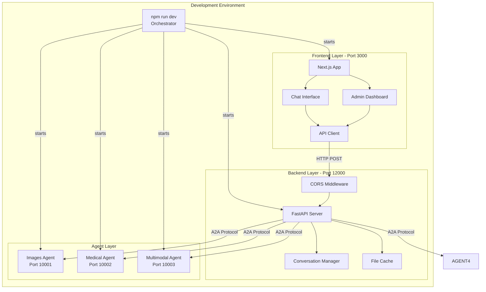
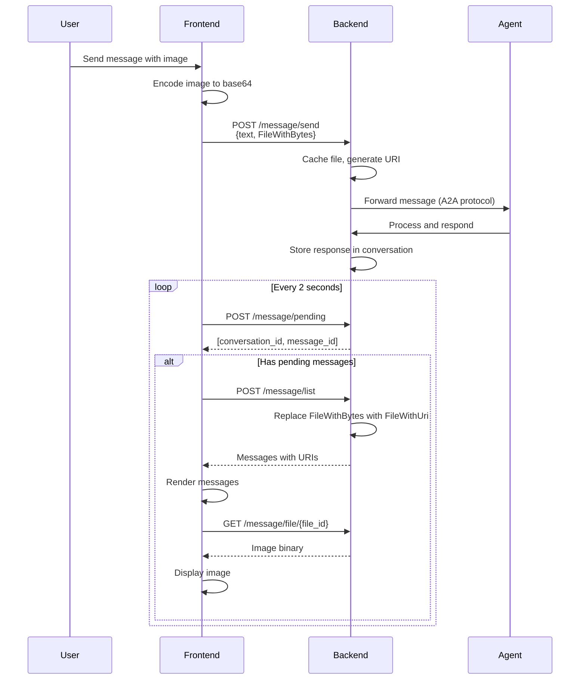

# Design Document: Frontend Integration

## Overview

This design document specifies the technical architecture for integrating the Next.js frontend application (a2a-frontend) with the existing Python backend system. The integration creates a unified development environment where a single command orchestrates multiple processes: the FastAPI backend server, multiple Python agent processes, and the Next.js frontend application.

The system maintains a clear separation of concerns:

- **Backend Layer**: Python FastAPI server (port 12000) managing agent orchestration, conversation state, and file caching
- **Agent Layer**: Multiple Python agent processes (ports 10001-10003) providing specialized AI capabilities
- **Frontend Layer**: Next.js application providing chat interface and admin dashboard
- **Orchestration Layer**: npm scripts using concurrently to manage all processes

The frontend communicates with the backend via REST API endpoints, with real-time updates achieved through polling. File handling uses a caching strategy where images are stored server-side and referenced by URI in the frontend.

### Key Design Decisions

1. **Monorepo Structure**: All code resides in a single repository with the frontend in a dedicated `frontend/` directory, simplifying version control and deployment
2. **Process Orchestration**: Using npm + concurrently instead of Docker Compose for simpler local development and faster iteration
3. **Polling vs WebSockets**: Implementing HTTP polling for real-time updates to maintain simplicity and avoid WebSocket complexity
4. **File Caching Strategy**: Server-side file caching with URI references to avoid sending large base64 payloads repeatedly
5. **CORS Configuration**: Permissive CORS in development to allow frontend-backend communication across different ports

## Architecture

### System Architecture Diagram



### Communication Flow



### Directory Structure

```
project-root/
├── frontend/                          # Next.js application
│   ├── src/
│   │   ├── app/                      # Next.js 13+ app directory
│   │   │   ├── layout.tsx            # Root layout
│   │   │   ├── page.tsx              # Home page (chat)
│   │   │   └── admin/                # Admin dashboard routes
│   │   │       ├── layout.tsx
│   │   │       ├── page.tsx          # Dashboard home
│   │   │       ├── conversations/
│   │   │       ├── messages/
│   │   │       ├── events/
│   │   │       ├── tasks/
│   │   │       ├── agents/
│   │   │       └── settings/
│   │   ├── components/               # React components
│   │   │   ├── chat/
│   │   │   │   ├── ChatInterface.tsx
│   │   │   │   ├── MessageBubble.tsx
│   │   │   │   ├── ImageUpload.tsx
│   │   │   │   └── MessageList.tsx
│   │   │   ├── admin/
│   │   │   │   ├── ConversationTable.tsx
│   │   │   │   ├── MessageTable.tsx
│   │   │   │   ├── EventTable.tsx
│   │   │   │   ├── TaskTable.tsx
│   │   │   │   ├── AgentTable.tsx
│   │   │   │   └── SettingsPanel.tsx
│   │   │   └── ui/                   # shadcn/ui components
│   │   ├── lib/
│   │   │   ├── api/                  # API client
│   │   │   │   ├── client.ts         # Base HTTP client
│   │   │   │   ├── types.ts          # TypeScript types
│   │   │   │   ├── conversations.ts  # Conversation endpoints
│   │   │   │   ├── messages.ts       # Message endpoints
│   │   │   │   ├── agents.ts         # Agent endpoints
│   │   │   │   └── files.ts          # File endpoints
│   │   │   └── utils/
│   │   │       ├── polling.ts        # Polling utilities
│   │   │       └── file-utils.ts     # File encoding/decoding
│   │   └── styles/
│   │       └── globals.css           # Tailwind CSS
│   ├── public/
│   ├── package.json
│   ├── tsconfig.json
│   ├── next.config.js
│   └── tailwind.config.js
│
├── demo/ui/                          # Python backend (existing)
│   ├── main.py                       # FastAPI entry point
│   ├── service/
│   │   └── server/
│   │       └── server.py             # ConversationServer
│   └── ...
│
├── samples/python/agents/            # Python agents (existing)
│   ├── images/
│   ├── medical_Images/
│   └── multimodal/
│
├── package.json                      # Root package.json (orchestration)
├── .env                              # Environment variables
└── README.md
```

## Components and Interfaces

### Frontend Components

#### 1. API Client (`frontend/src/lib/api/client.ts`)

The API client provides a typed interface to the backend REST API.

**Responsibilities:**

- HTTP request/response handling
- Error handling and retry logic
- Request/response type validation
- Base URL configuration

**Key Methods:**

```typescript
class APIClient {
    private baseURL: string = "http://localhost:12000";

    async post<T>(endpoint: string, body: any): Promise<T>;
    async get<T>(endpoint: string): Promise<T>;
    private handleError(error: any): never;
}
```

#### 2. Message API (`frontend/src/lib/api/messages.ts`)

**Responsibilities:**

- Send messages with text and file parts
- List messages for a conversation
- Poll for pending messages
- Fetch file content by ID

**Key Methods:**

```typescript
interface MessageAPI {
    send(message: Message): Promise<MessageInfo>;
    list(conversationId: string): Promise<Message[]>;
    pending(): Promise<Array<[string, string]>>;
    getFile(fileId: string): Promise<Blob>;
}
```

#### 3. Polling Manager (`frontend/src/lib/utils/polling.ts`)

**Responsibilities:**

- Manage polling intervals
- Handle polling lifecycle (start/stop/pause)
- Coordinate multiple polling operations
- Error recovery and backoff

**Key Methods:**

```typescript
class PollingManager {
    start(callback: () => Promise<void>, interval: number): string;
    stop(pollId: string): void;
    stopAll(): void;
    private handleError(error: Error): void;
}
```

#### 4. Chat Interface (`frontend/src/components/chat/ChatInterface.tsx`)

**Responsibilities:**

- Display conversation messages
- Handle user text input
- Handle image upload and preview
- Trigger message sending
- Auto-scroll to latest message

**Props:**

```typescript
interface ChatInterfaceProps {
    conversationId: string;
    onMessageSent?: (message: Message) => void;
}
```

**State:**

```typescript
interface ChatState {
    messages: Message[];
    inputText: string;
    selectedImage: File | null;
    isLoading: boolean;
    error: string | null;
}
```

#### 5. Admin Dashboard (`frontend/src/app/admin/layout.tsx`)

**Responsibilities:**

- Navigation between admin sections
- Layout for admin pages
- Authentication/authorization (future)

**Sections:**

- Chat: Embedded chat interface
- Conversations: List and manage conversations
- Messages: View all messages across conversations
- Events: System event log
- Tasks: Task management
- Agents: Agent registration and status
- Settings: System configuration

### Backend Components

#### 1. ConversationServer (`demo/ui/service/server/server.py`)

**Existing component with modifications for frontend integration.**

**New/Modified Responsibilities:**

- Parse message dictionaries from frontend format
- Handle both FileWithBytes (new uploads) and FileWithUri (cached files)
- Maintain file cache with unique IDs
- Serve cached files via GET endpoint

**Key Methods:**

```python
class ConversationServer:
    def parse_message_from_dict(self, data: dict[str, Any]) -> Message
    def restore_files_from_cache(self, message: Message) -> Message
    def cache_content(self, messages: list[Message]) -> list[Message]
    async def _send_message(self, body: SendMessageBody, background_tasks: BackgroundTasks)
    async def _list_messages(self, body: ListMessagesBody)
    async def _pending_messages(self)
    def _files(self, file_id: str)
```

#### 2. CORS Middleware

**Responsibilities:**

- Allow cross-origin requests from frontend
- Configure allowed origins, methods, headers
- Handle preflight requests

**Configuration:**

```python
app.add_middleware(
    CORSMiddleware,
    allow_origins=["http://localhost:3000"],  # Frontend URL
    allow_credentials=True,
    allow_methods=["*"],
    allow_headers=["*"],
)
```

### Process Orchestration

#### Root package.json Scripts

```json
{
    "scripts": {
        "dev": "concurrently -n \"backend,frontend,img,med,mm\" -c \"blue,green,yellow,cyan,magenta\" \"npm run dev:backend\" \"npm run dev:frontend\" \"npm run dev:agent:images\" \"npm run dev:agent:medical\" \"npm run dev:agent:multimodal\"",
        "dev:backend": "cd demo/ui && uv run main.py",
        "dev:frontend": "cd frontend && npm run dev",
        "dev:agent:images": "cd samples/python/agents/images && uv run python -m app",
        "dev:agent:medical": "cd samples/python/agents/medical_Images && uv run python -m app",
        "dev:agent:multimodal": "cd samples/python/agents/multimodal && uv run python -m app",
        "install:frontend": "cd frontend && npm install",
        "build:frontend": "cd frontend && npm run build",
        "type-check": "cd frontend && npm run type-check"
    }
}
```

## Data Models

### TypeScript Types (Frontend)

```typescript
// frontend/src/lib/api/types.ts

export enum Role {
    USER = "user",
    AGENT = "agent",
    SYSTEM = "system",
}

export interface TextPart {
    kind: "text";
    text: string;
}

export interface FileWithBytes {
    bytes: string; // base64 encoded
    mime_type: string;
    name?: string;
}

export interface FileWithUri {
    uri: string;
    mime_type: string;
}

export interface FilePart {
    kind: "file";
    file: FileWithBytes | FileWithUri;
}

export type Part = TextPart | FilePart;

export interface Message {
    message_id: string;
    context_id: string;
    role: Role;
    parts: Part[];
    recipient?: string;
    metadata?: Record<string, any>;
}

export interface MessageInfo {
    message_id: string;
    context_id: string;
}

export interface Conversation {
    conversation_id: string;
    is_active: boolean;
    name: string;
    task_ids: string[];
    messages: Message[];
}

export interface Event {
    id: string;
    actor: string;
    content: Message;
    timestamp: number;
}

export interface Task {
    task_id: string;
    description: string;
    status: string;
    created_at: number;
}

export interface AgentCard {
    name: string;
    description: string;
    url: string;
    capabilities: string[];
}

// API Response types
export interface JSONRPCResponse<T> {
    jsonrpc: "2.0";
    id: string | number | null;
    result?: T;
    error?: {
        code: number;
        message: string;
        data?: any;
    };
}

export type SendMessageResponse = JSONRPCResponse<MessageInfo>;
export type ListMessageResponse = JSONRPCResponse<Message[]>;
export type ListConversationResponse = JSONRPCResponse<Conversation[]>;
export type PendingMessageResponse = JSONRPCResponse<Array<[string, string]>>;
export type GetEventResponse = JSONRPCResponse<Event[]>;
export type ListTaskResponse = JSONRPCResponse<Task[]>;
export type ListAgentResponse = JSONRPCResponse<AgentCard[]>;
```

### Python Types (Backend)

The backend already uses the A2A protocol types from the `a2a` package. Key types:

```python
# From a2a.types
class Message(BaseModel):
    message_id: str
    context_id: str | None
    role: Role  # Enum: user, agent, system
    parts: list[Part]
    recipient: str | None
    metadata: dict[str, Any] | None

class Part(BaseModel):
    root: TextPart | FilePart

class TextPart(BaseModel):
    kind: Literal['text'] = 'text'
    text: str

class FilePart(BaseModel):
    kind: Literal['file'] = 'file'
    file: FileWithBytes | FileWithUri

class FileWithBytes(BaseModel):
    bytes: str  # base64 encoded
    mime_type: str
    name: str | None

class FileWithUri(BaseModel):
    uri: str
    mime_type: str
```

### File Caching Data Structure

```python
# In ConversationServer
_file_cache: dict[str, FilePart] = {}
# Maps cache_id -> FilePart with FileWithBytes

_message_to_cache: dict[str, str] = {}
# Maps "message_id:part_index" -> cache_id
```

##

Correctness Properties

_A property is a characteristic or behavior that should hold true across all valid executions of a system—essentially, a formal statement about what the system should do. Properties serve as the bridge between human-readable specifications and machine-verifiable correctness guarantees._

### Property Reflection

After analyzing all acceptance criteria, I identified the following testable properties. During reflection, I found several opportunities to consolidate redundant properties:

- Properties about message sending (3.2) and message display (4.3, 4.7) can be combined into a comprehensive message round-trip property
- Properties about file handling (3.5, 10.1, 10.2, 10.4, 10.5) can be consolidated into file caching round-trip properties
- Properties about polling and message fetching (9.2, 9.3) are part of the same workflow and can be combined

The following properties represent the unique, non-redundant correctness guarantees for this system:

### Property 1: Message Send-Receive Round Trip

_For any_ valid message sent from the frontend (with text and/or file parts), when the message is sent to the backend via `/message/send` and then retrieved via `/message/list`, the message content should be preserved with text parts unchanged and file parts converted from FileWithBytes to FileWithUri.

**Validates: Requirements 3.2, 4.3, 4.7**

### Property 2: File Caching Uniqueness

_For any_ message containing FileWithBytes received by the backend, the backend should cache the file with a unique cache ID such that no two different files share the same cache ID.

**Validates: Requirements 10.1**

### Property 3: File Caching Round Trip

_For any_ file uploaded with a message, when the file is cached by the backend and later retrieved via `/message/file/{file_id}`, the file content and MIME type should be identical to the original upload.

**Validates: Requirements 3.5, 10.2, 10.4, 10.5**

### Property 4: Image Base64 Encoding

_For any_ image file selected by the user in the chat interface, when the image is prepared for sending, it should be encoded as a valid base64 string and included in the message parts as FileWithBytes.

**Validates: Requirements 4.5**

### Property 5: Image Preview Display

_For any_ image file uploaded by the user, when the file is selected, a preview should be displayed in the UI before the message is sent.

**Validates: Requirements 4.4**

### Property 6: Agent Auto-Registration

_For any_ agent process that successfully starts and is reachable at its configured URL, when the backend server starts, the agent should be automatically registered and appear in the agent list.

**Validates: Requirements 6.5**

### Property 7: Polling Triggers Message Fetch

_For any_ pending message notification returned by `/message/pending`, when the frontend receives the notification, it should trigger a fetch request to `/message/list` for the corresponding conversation.

**Validates: Requirements 9.2, 9.3**

### Property 8: File URI Resolution

_For any_ message part with FileWithUri returned by the backend, when the frontend renders the message, it should construct the correct file URL using the `/message/file/{file_id}` endpoint format.

**Validates: Requirements 10.3**

### Property 9: API Error Display

_For any_ API request that fails with an error response, when the frontend receives the error, it should display a user-friendly error message to the user.

**Validates: Requirements 11.4**

## Error Handling

### Frontend Error Handling

**Network Errors:**

- API client should catch network errors (connection refused, timeout, DNS failure)
- Display user-friendly error messages: "Unable to connect to server. Please check your connection."
- Implement exponential backoff for retries (1s, 2s, 4s, 8s, max 30s)
- Show retry button for manual retry attempts

**API Errors:**

- Parse JSON-RPC error responses with code, message, and data fields
- Map error codes to user-friendly messages:
    - 404: "Resource not found"
    - 500: "Server error. Please try again later."
    - 400: Display the specific validation error from the server
- Log full error details to console for debugging
- Show error notifications using toast/snackbar UI components

**File Upload Errors:**

- Validate file size before upload (max 10MB)
- Validate file type (images: jpg, png, gif, webp)
- Display specific error messages:
    - "File too large. Maximum size is 10MB."
    - "Unsupported file type. Please upload an image."
- Clear file selection on error
- Allow user to retry with a different file

**Polling Errors:**

- If polling fails, increase retry interval from 2s to 5s
- After 3 consecutive failures, show warning: "Connection unstable. Retrying..."
- After 10 consecutive failures, stop polling and show error: "Lost connection to server."
- Provide "Reconnect" button to restart polling
- Resume normal polling interval (2s) after successful request

### Backend Error Handling

**Message Parsing Errors:**

- Validate message structure before processing
- Return 400 Bad Request with specific error message:
    - "Missing required field: parts"
    - "Invalid part kind: {kind}"
    - "Invalid role: {role}"
- Log parsing errors with full request body for debugging
- Do not crash the server on invalid input

**File Caching Errors:**

- Handle base64 decoding errors gracefully
- Return 400 Bad Request: "Invalid base64 encoding in file part"
- Handle disk space errors when caching files
- Return 507 Insufficient Storage: "Unable to cache file. Server storage full."
- Implement cache size limit (1GB) with LRU eviction

**Agent Communication Errors:**

- Catch HTTP errors when forwarding messages to agents
- Log agent errors with agent URL and error details
- Return error to frontend: "Agent {agent_name} is unavailable"
- Mark agent as unhealthy after 3 consecutive failures
- Retry agent registration on startup if initial registration fails

**File Serving Errors:**

- Return 404 Not Found if file_id not in cache
- Return 500 Internal Server Error if file read fails
- Log file serving errors with file_id and error details
- Handle corrupted cache entries by removing them and returning 410 Gone

**CORS Errors:**

- Ensure CORS middleware is configured before route handlers
- Log CORS preflight requests for debugging
- Return appropriate CORS headers for all responses
- In production, restrict allow_origins to specific frontend domain

## Testing Strategy

### Dual Testing Approach

This feature requires both unit tests and property-based tests to ensure comprehensive coverage:

**Unit Tests** focus on:

- Specific examples of API endpoint behavior
- UI component rendering with specific props
- Error handling for specific failure scenarios
- Configuration validation (environment variables, package.json scripts)
- Integration points between frontend and backend

**Property-Based Tests** focus on:

- Universal properties that hold for all valid inputs
- Message round-trip correctness across all message types
- File caching correctness across all file types and sizes
- API client behavior across all possible responses
- Polling behavior across all timing scenarios

### Frontend Testing

**Framework:** Jest + React Testing Library + fast-check (for property-based testing)

**Unit Tests:**

1. API Client configuration uses correct base URL (http://localhost:12000)
2. Chat interface renders text input and image upload button
3. Admin dashboard renders all 7 navigation tabs
4. Clicking each tab navigates to the correct route
5. Polling starts when component mounts and stops when unmounted
6. Polling interval is 2 seconds for normal operation
7. Polling interval increases to 5 seconds after error
8. File upload validates file size (max 10MB)
9. File upload validates file type (images only)
10. Error notification displays when file upload fails
11. TypeScript build completes without type errors
12. tsconfig.json has strict mode enabled

**Property-Based Tests:**

_Test 1: Image Base64 Encoding Property_

```typescript
// Feature: frontend-integration, Property 4: For any image file selected by the user, it should be encoded as valid base64
fc.assert(
    fc.property(
        fc.uint8Array({ minLength: 100, maxLength: 10000 }), // Random image data
        (imageData) => {
            const file = new File([imageData], "test.png", {
                type: "image/png",
            });
            const encoded = encodeFileToBase64(file);

            // Should be valid base64
            expect(() => atob(encoded)).not.toThrow();

            // Should decode back to original data
            const decoded = Uint8Array.from(atob(encoded), (c) =>
                c.charCodeAt(0)
            );
            expect(decoded).toEqual(imageData);
        }
    ),
    { numRuns: 100 }
);
```

_Test 2: File URI Resolution Property_

```typescript
// Feature: frontend-integration, Property 8: For any FileWithUri, frontend should construct correct file URL
fc.assert(
    fc.property(
        fc.uuid(), // Random file ID
        (fileId) => {
            const fileUri = `/message/file/${fileId}`;
            const resolvedUrl = resolveFileUrl(fileUri);

            expect(resolvedUrl).toBe(
                `http://localhost:12000/message/file/${fileId}`
            );
        }
    ),
    { numRuns: 100 }
);
```

_Test 3: API Error Display Property_

```typescript
// Feature: frontend-integration, Property 9: For any API error, frontend should display user-friendly message
fc.assert(
  fc.property(
    fc.record({
      code: fc.integer({ min: 400, max: 599 }),
      message: fc.string(),
    }),
    (error) => {
      const { container } = render(<ChatInterface conversationId="test" />);

      // Simulate API error
      act(() => {
        apiClient.simulateError(error);
      });

      // Should display error message
      const errorElement = screen.queryByRole('alert');
      expect(errorElement).toBeInTheDocument();
      expect(errorElement).toHaveTextContent(/error|failed|unable/i);
    }
  ),
  { numRuns: 100 }
);
```

### Backend Testing

**Framework:** pytest + Hypothesis (for property-based testing)

**Unit Tests:**

1. Backend server starts on port 12000
2. CORS middleware allows requests from http://localhost:3000
3. `/conversation/list` endpoint returns list of conversations
4. `/message/list` endpoint returns messages for a conversation
5. `/message/pending` endpoint returns pending message notifications
6. `/agent/list` endpoint returns registered agents
7. Environment variable A2A_UI_HOST defaults to '0.0.0.0'
8. Environment variable A2A_UI_PORT defaults to '12000'
9. File serving endpoint returns 404 for non-existent file_id
10. File serving endpoint returns correct MIME type for cached files

**Property-Based Tests:**

_Test 1: Message Round Trip Property_

```python
# Feature: frontend-integration, Property 1: Message send-receive preserves content
@given(
    text=st.text(min_size=1, max_size=1000),
    role=st.sampled_from(['user', 'agent', 'system']),
)
def test_message_round_trip(text, role):
    # Create message
    message = Message(
        message_id=str(uuid.uuid4()),
        context_id='test-context',
        role=role,
        parts=[Part(root=TextPart(text=text))],
    )

    # Send message
    response = client.post('/message/send', json={'params': message.model_dump()})
    assert response.status_code == 200

    # Retrieve messages
    response = client.post('/message/list', json={'params': 'test-context'})
    messages = response.json()['result']

    # Find our message
    sent_message = next(m for m in messages if m['message_id'] == message.message_id)

    # Text should be preserved
    assert sent_message['parts'][0]['text'] == text
    assert sent_message['role'] == role
```

_Test 2: File Caching Uniqueness Property_

```python
# Feature: frontend-integration, Property 2: Each file gets unique cache ID
@given(
    files=st.lists(
        st.binary(min_size=100, max_size=10000),
        min_size=2,
        max_size=10,
        unique=True
    )
)
def test_file_caching_uniqueness(files):
    cache_ids = []

    for file_data in files:
        # Create message with file
        message = Message(
            message_id=str(uuid.uuid4()),
            context_id='test-context',
            role='user',
            parts=[Part(root=FilePart(file=FileWithBytes(
                bytes=base64.b64encode(file_data).decode(),
                mime_type='image/png'
            )))],
        )

        # Send message
        response = client.post('/message/send', json={'params': message.model_dump()})
        assert response.status_code == 200

        # Get messages to extract cache ID
        response = client.post('/message/list', json={'params': 'test-context'})
        messages = response.json()['result']

        # Extract cache ID from URI
        file_uri = messages[-1]['parts'][0]['file']['uri']
        cache_id = file_uri.split('/')[-1]
        cache_ids.append(cache_id)

    # All cache IDs should be unique
    assert len(cache_ids) == len(set(cache_ids))
```

_Test 3: File Caching Round Trip Property_

```python
# Feature: frontend-integration, Property 3: File upload-download preserves content
@given(
    file_data=st.binary(min_size=100, max_size=10000),
    mime_type=st.sampled_from(['image/png', 'image/jpeg', 'image/gif', 'image/webp']),
)
def test_file_round_trip(file_data, mime_type):
    # Create message with file
    encoded = base64.b64encode(file_data).decode()
    message = Message(
        message_id=str(uuid.uuid4()),
        context_id='test-context',
        role='user',
        parts=[Part(root=FilePart(file=FileWithBytes(
            bytes=encoded,
            mime_type=mime_type
        )))],
    )

    # Send message
    response = client.post('/message/send', json={'params': message.model_dump()})
    assert response.status_code == 200

    # Get messages to extract file URI
    response = client.post('/message/list', json={'params': 'test-context'})
    messages = response.json()['result']
    file_uri = messages[-1]['parts'][0]['file']['uri']

    # Download file
    response = client.get(file_uri)
    assert response.status_code == 200
    assert response.headers['content-type'] == mime_type

    # Content should match original
    assert response.content == file_data
```

_Test 4: Agent Auto-Registration Property_

```python
# Feature: frontend-integration, Property 6: Started agents are auto-registered
@given(
    agent_ports=st.lists(
        st.integers(min_value=10001, max_value=10010),
        min_size=1,
        max_size=4,
        unique=True
    )
)
def test_agent_auto_registration(agent_ports):
    # Start mock agents on specified ports
    mock_agents = []
    for port in agent_ports:
        agent = start_mock_agent(port)
        mock_agents.append(agent)

    # Wait for auto-registration
    time.sleep(1)

    # Get agent list
    response = client.post('/agent/list')
    agents = response.json()['result']

    # All started agents should be registered
    registered_urls = [agent['url'] for agent in agents]
    for port in agent_ports:
        expected_url = f'http://localhost:{port}'
        assert expected_url in registered_urls

    # Cleanup
    for agent in mock_agents:
        agent.stop()
```

### Integration Testing

**End-to-End Tests:**

1. Start all processes with `npm run dev`
2. Verify backend is accessible at http://localhost:12000
3. Verify frontend is accessible at http://localhost:3000
4. Verify all 3 agents are running on ports 10001-10003
5. Send a text message from frontend and verify it appears in the conversation
6. Upload an image from frontend and verify it displays correctly
7. Navigate to each admin dashboard tab and verify data loads
8. Stop one agent and verify error handling
9. Restart agent and verify it re-registers

**Performance Tests:**

1. Send 100 messages rapidly and verify all are processed
2. Upload 10 images simultaneously and verify all are cached
3. Poll for messages with 100 concurrent clients
4. Verify file cache doesn't exceed 1GB limit
5. Measure message round-trip latency (should be < 500ms)

### Test Configuration

**Property-Based Test Settings:**

- Minimum 100 iterations per property test
- Use seed for reproducible failures
- Shrink failing examples to minimal case
- Tag each test with feature name and property number

**Coverage Goals:**

- Frontend: 80% line coverage, 70% branch coverage
- Backend: 85% line coverage, 75% branch coverage
- Integration: All critical user flows covered

**CI/CD Integration:**

- Run unit tests on every commit
- Run property-based tests on every PR
- Run integration tests before merge to main
- Run performance tests nightly
