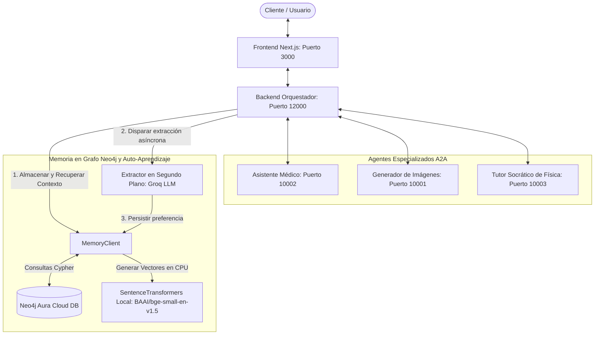

# Agent2Agent (A2A) Samples

Welcome to the A2A Samples repository! Here you will find code samples and demos using the Agent2Agent protocol.

<a href="https://studio.firebase.google.com/new?template=https%3A%2F%2Fgithub.com%2Fa2aproject%2Fa2a-samples%2Ftree%2Fmain%2F.firebase-studio">
  <picture>
    <source
      media="(prefers-color-scheme: dark)"
      srcset="https://cdn.firebasestudio.dev/btn/try_light_20.svg">
    <source
      media="(prefers-color-scheme: light)"
      srcset="https://cdn.firebasestudio.dev/btn/try_dark_20.svg">
    
  </picture>
</a>

<div style="text-align: right;">
  <details>
    <summary>🌐 Language</summary>
    <div style="text-align: center;">
      <a href="https://openaitx.github.io/view.html?user=a2aproject&project=a2a-samples&lang=en">English</a>
      | <a href="https://openaitx.github.io/view.html?user=a2aproject&project=a2a-samples&lang=zh-CN">简体中文</a>
      | <a href="https://openaitx.github.io/view.html?user=a2aproject&project=a2a-samples&lang=zh-TW">繁體中文</a>
      | <a href="https://openaitx.github.io/view.html?user=a2aproject&project=a2a-samples&lang=ja">日本語</a>
      | <a href="https://openaitx.github.io/view.html?user=a2aproject&project=a2a-samples&lang=ko">한국어</a>
      | <a href="https://openaitx.github.io/view.html?user=a2aproject&project=a2a-samples&lang=hi">हिन्दी</a>
      | <a href="https://openaitx.github.io/view.html?user=a2aproject&project=a2a-samples&lang=th">ไทย</a>
      | <a href="https://openaitx.github.io/view.html?user=a2aproject&project=a2a-samples&lang=fr">Français</a>
      | <a href="https://openaitx.github.io/view.html?user=a2aproject&project=a2a-samples&lang=de">Deutsch</a>
      | <a href="https://openaitx.github.io/view.html?user=a2aproject&project=a2a-samples&lang=es">Español</a>
      | <a href="https://openaitx.github.io/view.html?user=a2aproject&project=a2a-samples&lang=it">Italiano</a>
      | <a href="https://openaitx.github.io/view.html?user=a2aproject&project=a2a-samples&lang=ru">Русский</a>
      | <a href="https://openaitx.github.io/view.html?user=a2aproject&project=a2a-samples&lang=pt">Português</a>
      | <a href="https://openaitx.github.io/view.html?user=a2aproject&project=a2a-samples&lang=nl">Nederlands</a>
      | <a href="https://openaitx.github.io/view.html?user=a2aproject&project=a2a-samples&lang=pl">Polski</a>
      | <a href="https://openaitx.github.io/view.html?user=a2aproject&project=a2a-samples&lang=ar">العربية</a>
      | <a href="https://openaitx.github.io/view.html?user=a2aproject&project=a2a-samples&lang=fa">فارسی</a>
      | <a href="https://openaitx.github.io/view.html?user=a2aproject&project=a2a-samples&lang=tr">Türkçe</a>
      | <a href="https://openaitx.github.io/view.html?user=a2aproject&project=a2a-samples&lang=vi">Tiếng Việt</a>
      | <a href="https://openaitx.github.io/view.html?user=a2aproject&project=a2a-samples&lang=id">Bahasa Indonesia</a>
    </div>
  </details>
</div>

This repository contains code samples and demos which use the [Agent2Agent (A2A) Protocol](https://goo.gle/a2a).

## 🚀 Quick Start

This repository has been configured to use **Groq (Llama 4)** for ultra-fast agent responses.

### Prerequisites

1. **Groq API Key** - Get one at [console.groq.com](https://console.groq.com)
2. **Google API Key** (optional) - Only needed for image generation
3. **Python 3.12+** with `uv` package manager
4. **Node.js 18+** for the frontend

### Setup

1. Clone the repository:
   ```bash
   git clone https://github.com/dracero/a2a-test-alone.git
   cd a2a-test-alone
   ```

2. Copy `.env.example` to `.env` and add your API keys:
   ```bash
   cp .env.example .env
   # Edit .env and add your GROQ_API_KEY
   ```

3. Start all services:
   ```bash
   npm run dev
   ```
   *Note: This runs the `start_ordered.py` script natively, starting the agents, waiting for their ports to be ready, and then launching the backend orchestrator and Next.js frontend. Works on Windows, macOS, and Linux natively without WSL.*

4. Open your browser at [http://localhost:3000](http://localhost:3000)

### Documentation

- **[INICIO-RAPIDO.md](INICIO-RAPIDO.md)** - Quick start guide (Spanish)
- **[RESUMEN-COMPLETO.md](RESUMEN-COMPLETO.md)** - Complete summary of changes
- **[CAMBIO-A-GROQ.md](CAMBIO-A-GROQ.md)** - Groq migration details

## Architecture & Ecosistema

Este sistema se compone de los siguientes elementos organizados de forma concurrente y orquestada:



### Componentes Clave

1. **3 Agentes Especializados**:
   - **Generador de Imágenes** (puerto 10001): Usa CrewAI + Stable Diffusion XL (vía Hugging Face Inference API) para generar y editar imágenes basándose en prompts de texto.
   - **Asistente Médico** (puerto 10002): Analiza imágenes médicas (radiografías, resonancias) y realiza búsquedas complementarias con Tavily.
   - **Tutor Socrático de Física** (puerto 10003): Utiliza procesamiento de PDFs (base vectorial Qdrant) y enseña a los estudiantes mediante el método socrático formulando preguntas guía en base a la bibliografía oficial de Física I.

2. **Backend Orquestador** (puerto 12000):
   - Construido con FastAPI y **BeeAI Workflow**.
   - Analiza el contexto de la conversación y enruta dinámicamente las consultas del usuario al agente más calificado.
   - Integrado con **Neo4j Agent Memory** y un bucle de **Auto-Aprendizaje (Self-Learning)**:
     - **Memoria a Corto Plazo**: Registra el historial de interacciones en el grafo.
     - **Memoria a Largo Plazo**: Recupera las preferencias del usuario y las inyecta en los prompts del orquestador.
     - **Auto-Aprendizaje**: Analiza asíncronamente en segundo plano si el usuario expresó nombres, preferencias académicas o correcciones, guardándolas permanentemente en Neo4j Aura Cloud DB sin ralentizar las respuestas.
     - **Embeddings Locales**: Genera vectores localmente usando `SentenceTransformers` (modelo `BAAI/bge-small-en-v1.5`), eliminando costes y dependencias de claves de OpenAI.

3. **Frontend** (puerto 3000):
   - Aplicación Next.js React moderna y responsiva.
   - Dashboard de administración para monitorizar los agentes y el inspector del protocolo A2A.
   - Chat interactivo en tiempo real con soporte multimedia (texto, PDF e imágenes).

## 🧠 NAMS: Neo4j Agent Memory System

NAMS es un sistema avanzado de gestión de memoria para agentes inteligentes basado en **Neo4j Aura Cloud DB** y **SentenceTransformers** (ejecutado localmente en CPU). 

Su arquitectura divide la cognición en tres subsistemas clave:

### 1. Memoria a Corto Plazo (Conversacional)
* **Función**: Almacena cada intercambio de mensajes (User/Assistant) en una estructura de grafo dirigida por `session_id`.
* **Beneficio**: Permite al orquestador reconstruir el hilo completo del diálogo en formato conversacional nativo y recuperar los últimos mensajes para mantener la coherencia semántica inmediata.

### 2. Memoria a Largo Plazo (Perfil & Preferencias)
* **Función**: Almacena hechos aprendidos sobre el usuario (nombre, dificultades específicas de aprendizaje, velocidad preferida, etc.) como nodos de entidad vinculados a su usuario único.
* **Flujo**: Antes de despachar cada nueva consulta a un agente, el orquestador recupera las preferencias almacenadas y las inyecta dinámicamente como directrices contextuales (ej. `"El estudiante prefiere explicaciones matemáticas detalladas, se llama Diego y tiene dificultades en cinemática"`).

### 3. Bucle de Auto-Aprendizaje Asíncrono (Self-Learning)
* **Proceso**: Al finalizar cada respuesta al usuario, el orquestador dispara una rutina asíncrona en segundo plano:
  1. Envía el último intercambio al extractor de preferencias (alimentado por Groq LLM).
  2. Si se detecta un hecho valioso, corrección o dato de perfil, se genera una preferencia.
  3. La preferencia se vectoriza localmente usando el modelo `BAAI/bge-small-en-v1.5` de `SentenceTransformers` (vector de 384 dimensiones).
  4. Se persiste el nuevo nodo y vector en la base de datos en grafo Neo4j.
* **Beneficio**: Este análisis ocurre de manera completamente asíncrona en segundo plano sin añadir un solo milisegundo de latencia a las interacciones de chat en tiempo real del usuario.

---

## 📊 Evaluación con LangSmith (Métricas de Generación y Recuperación)

Para evaluar y monitorizar el rendimiento de los agentes de forma independiente, hemos implementado evaluadores personalizados en Python utilizando la API de LangSmith (opción de evaluador personalizado `RunEvaluator`). Esto permite registrar métricas como **Context Relevance** (Relevancia del Contexto) y **Context Recall** (Exhaustividad del Contexto) directamente en tu consola de LangSmith.

Los evaluadores se dividen en dos áreas clave:

### 1. Métricas de Generación (Generation Metrics)
*   **Correctness / QA (`cot_qa`):** Mide si la respuesta generada por el agente es fácticamente correcta comparada con una respuesta de referencia/ideal (Ground Truth) utilizando *LLM-as-a-judge*.
*   **Faithfulness / Groundedness:** Evalúa si la respuesta generada se basa *exclusivamente* en la información recuperada del contexto para descartar alucinaciones.

### 2. Métricas de Recuperación Personalizadas (Retrieval Metrics)
*   **Context Relevance (`context_relevance`):** Califica (de `0.0` a `1.0`) si los fragmentos de texto o imágenes recuperadas del buscador de Qdrant son útiles y relevantes para responder a la consulta del usuario.
*   **Context Recall (`context_recall`):** Determina qué proporción de los conceptos, fórmulas y datos clave del Ground Truth (respuesta de referencia) están cubiertos por el contexto recuperado del buscador.

---

### 🚀 Scripts de Evaluación Disponibles

Cada agente cuenta con su propio script de evaluación independiente que define y ejecuta estas métricas personalizadas sobre un dataset de LangSmith:

#### A. Agente Multimodal (Física)
*   **Archivo:** [evaluate_langsmith.py](file:///run/media/cetec/c182e059-3c92-4885-9b5a-0b2f0aeaadfe/AIProjects/a2a-test-alone/samples/python/agents/multimodal/evaluate_langsmith.py)
*   **Lógica:** Inspecciona el sub-run `retriever` para extraer los textos obtenidos de los PDFs de física. Utiliza un LLM (Gemini 2.5 Flash con rotador de claves) para actuar como juez experto y puntuar la relevancia y el recall.
*   **Ejecución:**
    ```bash
    cd samples/python/agents/multimodal
    uv run python evaluate_langsmith.py
    ```

#### B. Agente Médico (Asistente de Imágenes Médicas)
*   **Archivo:** [evaluate_langsmith.py](file:///run/media/cetec/c182e059-3c92-4885-9b5a-0b2f0aeaadfe/AIProjects/a2a-test-alone/samples/python/agents/medical_Images/evaluate_langsmith.py)
*   **Lógica:** Extrae las figuras y descripciones clínicas recuperadas del RAG dual en dos etapas (`buscar_muvera_2stage`). Califica si el contexto de patología recuperado es útil y suficiente para orientar el diagnóstico de referencia.
*   **Ejecución:**
    ```bash
    cd samples/python/agents/medical_Images
    uv run python evaluate_langsmith.py
    ```

---

## 🤖 Automated PR Reviewer (AI Code Review)

Hemos implementado un revisor de código automatizado basado en **Gemini** y las reglas definidas en el espacio de trabajo. Este sistema analiza cada Pull Request contra las directrices de diseño, rendimiento y buenas prácticas del proyecto.

### Componentes Clave

1. **Directrices de Desarrollo ([.agents/AGENTS.md](file:///run/media/dracero/DiscoMecanico/AIProjects/a2a-test-alone/.agents/AGENTS.md))**:
   Define las reglas específicas que el agente de revisión (y otros agentes de desarrollo) debe validar:
   - **Principios Generales**: Claridad, respuestas accionables, seguridad de credenciales y secretos.
   - **Python y SDK de A2A**: Tipado estricto, uso correcto del protocolo A2A y manejo robusto de excepciones.
   - **Rendimiento GPU/PyTorch**: Gestión óptima de memoria CUDA (ej. RTX 3060), minimización de transferencias CPU-GPU, uso de `inference_mode`.
   - **Frontend & Next.js/TypeScript**: Evitar el tipo `any`, diseño premium y responsivo, optimización de renderizados.
   - **Complejidad y Optimización de BD**: Optimización de consultas Neo4j/Qdrant, evitar problemas de N+1 y optimización algorítmica.

2. **Script de Revisión ([scripts/review_pr.py](file:///run/media/dracero/DiscoMecanico/AIProjects/a2a-test-alone/scripts/review_pr.py))**:
   - Obtiene el diff del PR directamente de la API de GitHub (con mecanismos de reintento para evitar errores HTTP 406 Not Acceptable).
   - Lee las reglas definidas en `AGENTS.md`.
   - Llama a la API de **Gemini** (usa `gemini-2.5-flash` con el nuevo SDK `google-genai`, o cae automáticamente a `gemini-1.5-flash` con `google-generativeai`).
   - Envía el análisis como un comentario automatizado formateado en Markdown directamente en la discusión del PR.

3. **Workflow de GitHub Actions ([.github/workflows/ai-review.yml](file:///run/media/dracero/DiscoMecanico/AIProjects/a2a-test-alone/.github/workflows/ai-review.yml))**:
   - Automatiza la ejecución en GitHub ante eventos de Pull Request (`opened`, `synchronize`, `reopened`).
   - Requiere la configuración de secretos: `GEMINI_API_KEY` y el token implícito `GITHUB_TOKEN`.

### Ejecución Local (Dry-Run / Pruebas)

Puedes probar el revisor localmente antes de subir tus cambios a GitHub:

1. Asegúrate de tener las dependencias instaladas y las variables configuradas:
   ```bash
   pip install google-genai requests
   export GEMINI_API_KEY="tu_api_key_aquí"
   ```

2. Genera un archivo `.diff` o ejecuta con un PR existente:
   ```bash
   # Opción A: Probar con un archivo diff local
   git diff main > cambios.diff
   python scripts/review_pr.py --diff-file cambios.diff --dry-run

   # Opción B: Probar con un PR remoto real en modo lectura/dry-run
   python scripts/review_pr.py --repo "dracero/a2a-test-alone" --pr 12 --dry-run
   ```

---

## Related Repositories

-   [A2A](https://github.com/a2aproject/A2A) - A2A Specification and documentation.
-   [a2a-python](https://github.com/a2aproject/a2a-python) - A2A Python SDK.
-   [a2a-inspector](https://github.com/a2aproject/a2a-inspector) - UI tool for inspecting A2A enabled agents.

## Contributing

Contributions welcome! See the [Contributing Guide](CONTRIBUTING.md).

## Getting help

Please use the [issues page](https://github.com/a2aproject/a2a-samples/issues) to provide suggestions, feedback or submit a bug report.

## Disclaimer

This repository itself is not an officially supported Google product. The code in this repository is for demonstrative purposes only.

Important: The sample code provided is for demonstration purposes and illustrates the mechanics of the Agent-to-Agent (A2A) protocol. When building production applications, it is critical to treat any agent operating outside of your direct control as a potentially untrusted entity.

All data received from an external agent—including but not limited to its AgentCard, messages, artifacts, and task statuses—should be handled as untrusted input. For example, a malicious agent could provide an AgentCard containing crafted data in its fields (e.g., description, name, skills.description). If this data is used without sanitization to construct prompts for a Large Language Model (LLM), it could expose your application to prompt injection attacks. Failure to properly validate and sanitize this data before use can introduce security vulnerabilities into your application.

Developers are responsible for implementing appropriate security measures, such as input validation and secure handling of credentials to protect their systems and users.

Recordar los .env en el root de cada directorio
