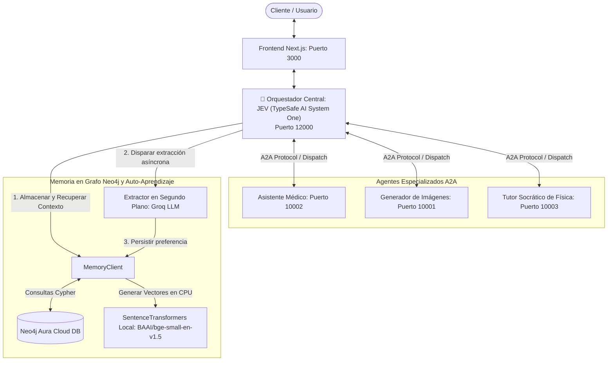
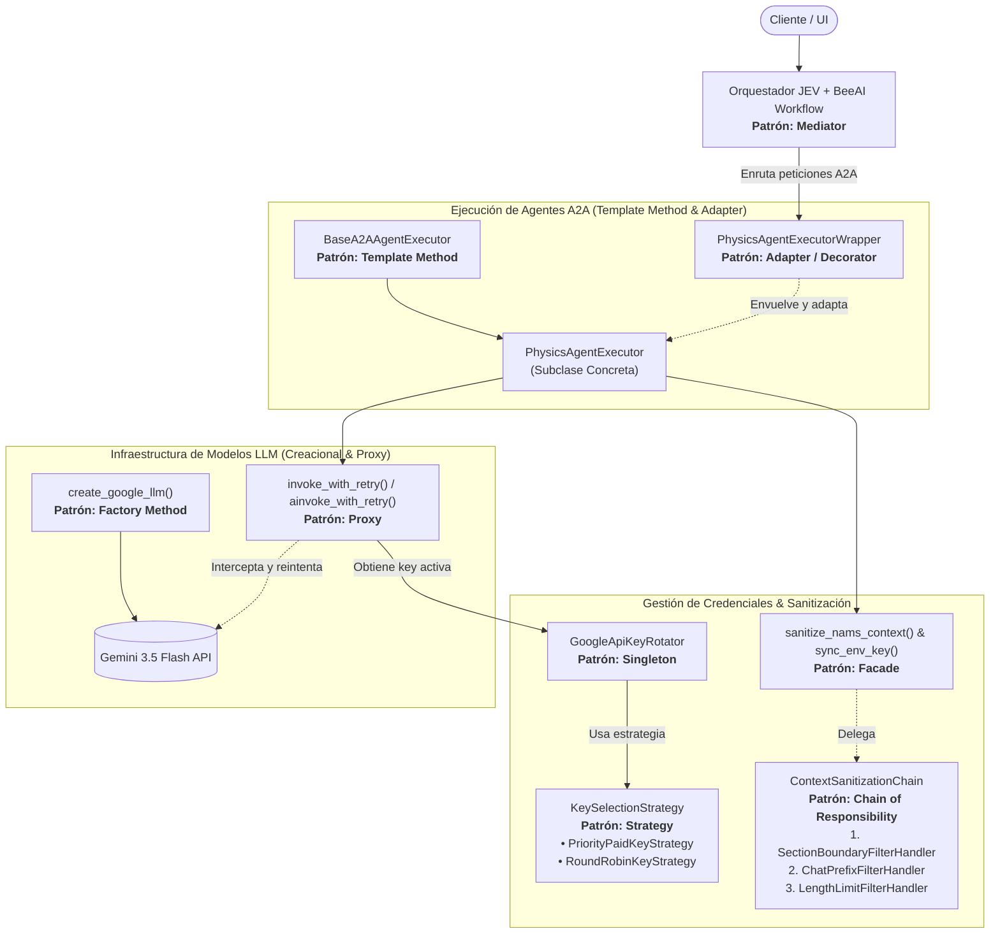
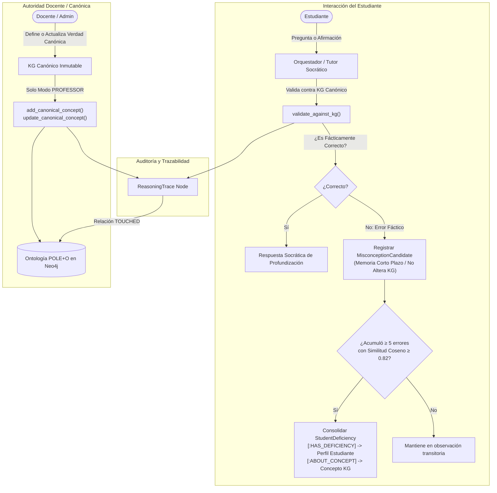
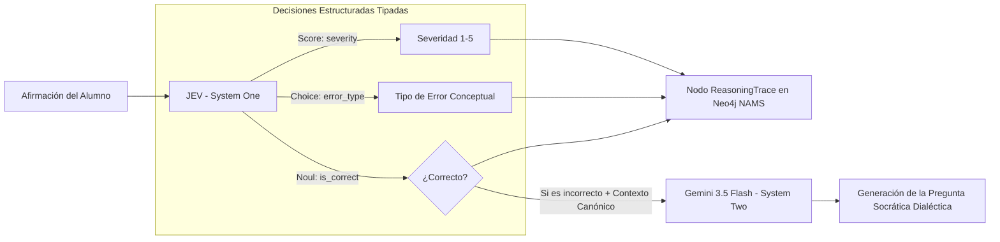
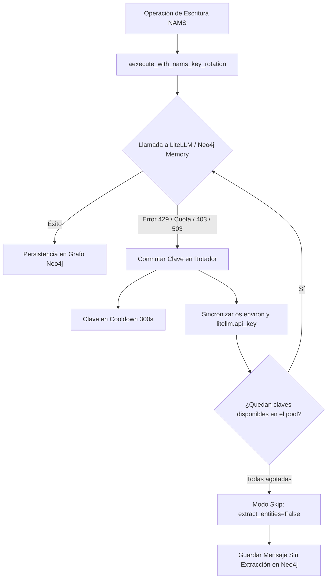
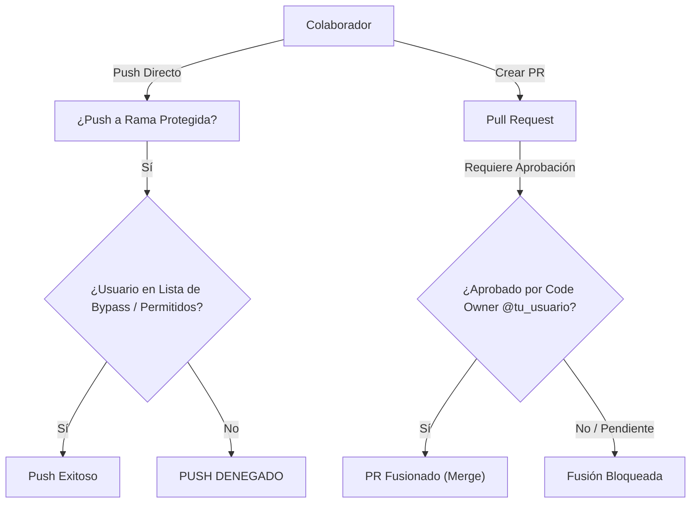

# Agent2Agent (A2A) Samples

Welcome to the A2A Samples repository! Here you will find code samples and demos using the Agent2Agent protocol.

<a href="https://studio.firebase.google.com/new?template=https%3A%2F%2Fgithub.com%2Fa2aproject%2Fa2a-samples%2Ftree%2Fmain%2F.firebase-studio">
  <picture>
    <source
      media="(prefers-color-scheme: dark)"
      srcset="https://cdn.firebasestudio.dev/btn/try_light_20.svg">
    <source
      media="(prefers-color-scheme: light)"
      srcset="https://cdn.firebasestudio.dev/btn/try_dark_20.svg">
    
  </picture>
</a>

<div style="text-align: right;">
  <details>
    <summary>🌐 Language</summary>
    <div style="text-align: center;">
      <a href="https://openaitx.github.io/view.html?user=a2aproject&project=a2a-samples&lang=en">English</a>
      | <a href="https://openaitx.github.io/view.html?user=a2aproject&project=a2a-samples&lang=zh-CN">简体中文</a>
      | <a href="https://openaitx.github.io/view.html?user=a2aproject&project=a2a-samples&lang=zh-TW">繁體中文</a>
      | <a href="https://openaitx.github.io/view.html?user=a2aproject&project=a2a-samples&lang=ja">日本語</a>
      | <a href="https://openaitx.github.io/view.html?user=a2aproject&project=a2a-samples&lang=ko">한국어</a>
      | <a href="https://openaitx.github.io/view.html?user=a2aproject&project=a2a-samples&lang=hi">हिन्दी</a>
      | <a href="https://openaitx.github.io/view.html?user=a2aproject&project=a2a-samples&lang=th">ไทย</a>
      | <a href="https://openaitx.github.io/view.html?user=a2aproject&project=a2a-samples&lang=fr">Français</a>
      | <a href="https://openaitx.github.io/view.html?user=a2aproject&project=a2a-samples&lang=de">Deutsch</a>
      | <a href="https://openaitx.github.io/view.html?user=a2aproject&project=a2a-samples&lang=es">Español</a>
      | <a href="https://openaitx.github.io/view.html?user=a2aproject&project=a2a-samples&lang=it">Italiano</a>
      | <a href="https://openaitx.github.io/view.html?user=a2aproject&project=a2a-samples&lang=ru">Русский</a>
      | <a href="https://openaitx.github.io/view.html?user=a2aproject&project=a2a-samples&lang=pt">Português</a>
      | <a href="https://openaitx.github.io/view.html?user=a2aproject&project=a2a-samples&lang=nl">Nederlands</a>
      | <a href="https://openaitx.github.io/view.html?user=a2aproject&project=a2a-samples&lang=pl">Polski</a>
      | <a href="https://openaitx.github.io/view.html?user=a2aproject&project=a2a-samples&lang=ar">العربية</a>
      | <a href="https://openaitx.github.io/view.html?user=a2aproject&project=a2a-samples&lang=fa">فارسی</a>
      | <a href="https://openaitx.github.io/view.html?user=a2aproject&project=a2a-samples&lang=tr">Türkçe</a>
      | <a href="https://openaitx.github.io/view.html?user=a2aproject&project=a2a-samples&lang=vi">Tiếng Việt</a>
      | <a href="https://openaitx.github.io/view.html?user=a2aproject&project=a2a-samples&lang=id">Bahasa Indonesia</a>
    </div>
  </details>
</div>

This repository contains code samples and demos which use the [Agent2Agent (A2A) Protocol](https://goo.gle/a2a).

> [!IMPORTANT]
> **Orquestador Central del Sistema: JEV (TypeSafe AI - System One)**  
> En esta plataforma, **el orquestador central es JEV (TypeSafe AI)**. JEV opera como el motor cognitivo de decisión de Tipo 1 (System One), responsable de la clasificación tipada de intenciones, el enrutamiento inteligente hacia los agentes especializados (`physics`, `medical`, `image` o respuesta directa) y el control de continuidad de sesiones conversacionales sin heurísticas frágiles.

## 🚀 Quick Start

Este repositorio utiliza **JEV (TypeSafe AI - System One)** como motor orquestador central y enrutador cognitivo de alta precisión, y **Google Gemini 3.5 Flash (`gemini-3.5-flash`)** como motor cognitivo principal para el razonamiento de los agentes, síntesis socrática, extracción ontológica NAMS y revisión automatizada de código, respaldado por un **sistema inteligente de rotación y resiliencia de claves API**.

### Prerequisites

1. **JEV (TypeSafe AI) API Key** (Orquestador System One):
   - Clave para el SDK de TypeSafe (`JEV_API_KEY` o `TYPESAFE_API_KEY`) que alimenta las decisiones tipadas del orquestador, clasificación de agentes y evaluación rápida.
2. **Google Gemini API Key(s)** (Cognición y Razonamiento):
   - Obtén tu(s) clave(s) en [Google AI Studio](https://aistudio.google.com/).
   - Soporta una o múltiples claves (`GOOGLE_API_KEYS` separadas por coma). El sistema prioriza automáticamente la clave paga con un cooldown acelerado de 15 segundos y conmuta a las claves secundarias si se alcanzan límites de cuota (429/403).
3. **Neo4j DB (Memoria NAMS)**:
   - En la nube vía [Neo4j Aura](https://neo4j.com/cloud/aura/) (`neo4j+s://...`) o local mediante Docker (`bolt://localhost:7687` con auto-inicio mediante contenedor `neo4j-local`).
4. **Groq API Key** (Opcional):
   - Para extracción de preferencias y autoaprendizaje en segundo plano.
5. **Python 3.12+** con el gestor de paquetes ultra-rápido `uv`.
6. **Node.js 18+** y `npm` para el frontend Next.js.
7. **Docker**: Para ejecutar bases de datos locales (`neo4j-local` en el puerto 7687 y `qdrant-local-histo` en el puerto 6333) gestionadas de forma automática por los scripts de inicio.

### Setup & Configuración

1. Clonar el repositorio:
   ```bash
   git clone https://github.com/dracero/a2a-test-alone.git
   cd a2a-test-alone
   ```

2. Configurar variables de entorno:
   ```bash
   cp .env.example .env
   ```
   Edita `.env` y configura tus credenciales:
   ```env
   # Orquestador Central JEV (TypeSafe AI - System One)
   JEV_API_KEY="apikey_tu_clave_jev..."
   TYPESAFE_API_KEY="apikey_tu_clave_jev..."

   # Claves de Google Gemini (separadas por comas; la primera es la cuenta paga/prioritaria)
   GOOGLE_API_KEYS="AIzaSyTuClavePaga...,AIzaSyTuClaveGratis1...,AIzaSyTuClaveGratis2..."
   GOOGLE_API_KEY="AIzaSyTuClavePaga..."

   # Memoria en Grafo Neo4j (POLE+O)
   NEO4J_URI="neo4j+s://xxxxxxxx.databases.neo4j.io"
   NEO4J_USERNAME="neo4j"
   NEO4J_PASSWORD="tu_password_aqui"
   NEO4J_DATABASE="neo4j"

   # Inferencia Auxiliar / Auto-Aprendizaje
   GROQ_API_KEY="gsk_tu_groq_api_key..."
   ```

3. Iniciar todos los servicios y agentes concurrentemente:
   ```bash
   npm run dev
   ```
   *Nota: `npm run dev` ejecuta `start_ordered.py`, que levanta los agentes especializados (Física en 10003, Medicina en 10002, Imágenes en 10001), verifica la disponibilidad de sus puertos y luego inicia el backend orquestador JEV (12000) y el frontend Next.js (3000).*

4. Abrir en el navegador: [http://localhost:3000](http://localhost:3000)

### Documentation & Guías

- **[INICIO-RAPIDO.md](INICIO-RAPIDO.md)** - Guía de inicio rápido paso a paso.
- **[RESUMEN-COMPLETO.md](RESUMEN-COMPLETO.md)** - Resumen completo de la arquitectura y cambios.
- **[CAMBIO-A-GROQ.md](CAMBIO-A-GROQ.md)** - Detalles de migración auxiliar a Groq.

## Architecture & Ecosistema

Este sistema se compone de los siguientes elementos organizados de forma concurrente y orquestada:


```mermaid
graph TD
    User([Cliente / Usuario]) <--> Frontend[Frontend Next.js: Puerto 3000]
    Frontend <--> Orchestrator["🧠 Orquestador Central: JEV (TypeSafe AI System One)<br/>Puerto 12000"]
    
    subgraph Agents [Agentes Especializados A2A]
        AgentMed[Asistente Médico: Puerto 10002]
        AgentImg[Generador de Imágenes: Puerto 10001]
        AgentPhys[Tutor Socrático de Física: Puerto 10003]
    end
    
    Orchestrator <-->|A2A Protocol / Dispatch| AgentMed
    Orchestrator <-->|A2A Protocol / Dispatch| AgentImg
    Orchestrator <-->|A2A Protocol / Dispatch| AgentPhys
    
    subgraph MemorySystem [Memoria en Grafo Neo4j y Auto-Aprendizaje]
        Neo4jClient[MemoryClient]
        AuraDB[(Neo4j Aura Cloud DB)]
        LocalEmbedder[SentenceTransformers Local: BAAI/bge-small-en-v1.5]
        LearningLoop[Extractor en Segundo Plano: Groq LLM]
    end
    
    Orchestrator -->|1. Almacenar y Recuperar Contexto| Neo4jClient
    Neo4jClient -->|Generar Vectores en CPU| LocalEmbedder
    Neo4jClient <-->|Consultas Cypher| AuraDB
    Orchestrator -->|2. Disparar extracción asíncrona| LearningLoop
    LearningLoop -->|3. Persistir preferencia| Neo4jClient
```

### Componentes Clave

1. **Orquestador Central: JEV (TypeSafe AI - System One)** (puerto 12000):
   - **El Orquestador es JEV**: Toda la inteligencia de despacho, decisión estructural y gestión de diálogos está comandada centralmente por **JEV** (`typesafe-sdk`). A diferencia de los enrutadores tradicionales basados en expresiones regulares o prompts de texto no estructurados, JEV transforma el lenguaje natural y el estado de la aplicación en juicios probabilísticos tipados, deterministas y calibrados en milisegundos:
     - **Enrutamiento Inteligente (`classify_agent_routing`)**: Utiliza la primitiva tipada `Choice` para determinar con precisión matemática y confianza cuantitativa cuál es el agente idóneo (Física, Medicina o Imágenes), o si la consulta debe resolverse de forma directa (`DIRECT`).
     - **Control de Intención de Sesión (`decide_session_continuation`)**: Evalúa en tiempo real si el mensaje del alumno mantiene el hilo dialéctico con el agente actual o si solicita explícitamente cambiar de tópico/agente.
     - **Evaluación Pedagógica System One (`evaluate_claim_hybrid_system_one`)**: Ejecuta en paralelo juicios de veracidad (`Noul`), tipo de error conceptual (`Choice`) y severidad (`Score`).
   - **Ejecución y Flujo A2A (BeeAI Workflow / Mediator)**: Implementa el patrón Mediator coordinando de forma desacoplada las invocaciones hacia los agentes A2A y transmitiendo streams SSE al frontend.
   - **Memoria NAMS Integrada (Neo4j Agent Memory)**:
     - **Memoria a Corto Plazo**: Registra el historial de interacciones en el grafo con rotación de claves.
     - **Memoria a Largo Plazo**: Recupera las preferencias del usuario y las inyecta en el orquestador.
     - **Auto-Aprendizaje**: Analiza asíncronamente en segundo plano nombres, preferencias académicas o correcciones, guardándolas permanentemente en Neo4j con rotación automática de claves.
     - **Embeddings Locales**: Genera vectores localmente usando `SentenceTransformers` (modelo `BAAI/bge-small-en-v1.5`), eliminando costes y dependencias de claves externas.

2. **3 Agentes Especializados A2A**:
   - **Generador de Imágenes** (puerto 10001): Usa CrewAI + Stable Diffusion XL (vía Hugging Face Inference API) para generar y editar imágenes basándose en prompts de texto.
   - **Asistente Médico** (puerto 10002): Analiza imágenes médicas (radiografías, resonancias) y realiza búsquedas complementarias con Tavily.
   - **Tutor Socrático de Física** (puerto 10003): Utiliza procesamiento de PDFs (base vectorial Qdrant) y enseña a los estudiantes mediante el método socrático formulando preguntas guía en base a la bibliografía oficial de Física I.

3. **Frontend Next.js** (puerto 3000):
   - Aplicación Next.js React moderna y responsiva.
   - Dashboard de administración para monitorizar los agentes y el inspector del protocolo A2A.
   - Chat interactivo en tiempo real con soporte multimedia (texto, PDF e imágenes).

---

## 🏛️ Arquitectura y Patrones de Diseño (GoF / Refactoring Guru)

El diseño de este sistema sigue rigurosamente los patrones de diseño clásicos (*Gang of Four - GoF*) documentados en el catálogo de referencia internacional **[Refactoring Guru: Design Patterns](https://refactoring.guru/design-patterns)**.

La arquitectura combina patrones **Creacionales**, **Estructurales** y de **Comportamiento** para garantizar desacoplamiento, extensibilidad, alta resiliencia de cuotas y mantenibilidad en un entorno de múltiples agentes autónomos colaborativos.

### 📐 Diagrama de Patrones del Sistema


```mermaid
graph TD
    User([Cliente / UI]) --> Orch[Orquestador JEV + BeeAI Workflow<br/><b>Patrón: Mediator</b>]
    
    subgraph "Ejecución de Agentes A2A (Template Method & Adapter)"
        BaseExec["BaseA2AAgentExecutor<br/><b>Patrón: Template Method</b>"]
        PhysicsExec["PhysicsAgentExecutor<br/>(Subclase Concreta)"]
        Wrapper["PhysicsAgentExecutorWrapper<br/><b>Patrón: Adapter / Decorator</b>"]
        BaseExec --> PhysicsExec
        Wrapper -.->|Envuelve y adapta| PhysicsExec
    end

    Orch -->|Enruta peticiones A2A| Wrapper

    subgraph "Infraestructura de Modelos LLM (Creacional & Proxy)"
        LLMFactory["create_google_llm()<br/><b>Patrón: Factory Method</b>"]
        ProxyInvoke["invoke_with_retry() / ainvoke_with_retry()<br/><b>Patrón: Proxy</b>"]
        LLM[(Gemini 3.5 Flash API)]
        
        LLMFactory --> LLM
        ProxyInvoke -.->|Intercepta y reintenta| LLM
    end

    subgraph "Gestión de Credenciales & Sanitización"
        Rotator["GoogleApiKeyRotator<br/><b>Patrón: Singleton</b>"]
        KeyStrategy["KeySelectionStrategy<br/><b>Patrón: Strategy</b><br/>• PriorityPaidKeyStrategy<br/>• RoundRobinKeyStrategy"]
        Chain["ContextSanitizationChain<br/><b>Patrón: Chain of Responsibility</b><br/>1. SectionBoundaryFilterHandler<br/>2. ChatPrefixFilterHandler<br/>3. LengthLimitFilterHandler"]
        Facade["sanitize_nams_context() & sync_env_key()<br/><b>Patrón: Facade</b>"]
        
        Rotator -->|Usa estrategia| KeyStrategy
        Facade -.->|Delega| Chain
        ProxyInvoke -->|Obtiene key activa| Rotator
    end

    PhysicsExec --> ProxyInvoke
    PhysicsExec --> Facade
```

---

### 📋 Matriz de Patrones Implementados

| Patrón (Refactoring Guru) | Categoría | Archivos Clave | Propósito y Beneficio Arquitectónico |
| :--- | :---: | :--- | :--- |
| **[Template Method](https://refactoring.guru/design-patterns/template-method)** | Comportamiento | [base_agent_executor.py](file:///run/media/dracero/DiscoMecanico1/AIProjects/a2a-test-alone/samples/python/agents/multimodal/app/base_agent_executor.py)<br/>[agent_executor.py](file:///run/media/dracero/DiscoMecanico1/AIProjects/a2a-test-alone/samples/python/agents/multimodal/app/agent_executor.py) | **Esqueleto invariable de ejecución A2A**: Define el ciclo de vida (validación $\to$ extracción de medios $\to$ streaming de tareas $\to$ artefactos $\to$ manejo de pipes y errores). Las subclases solo implementan hooks primitivos (`get_agent_stream`, `get_artifact_name`), eliminando más de 400 líneas de código repetido. |
| **[Chain of Responsibility](https://refactoring.guru/design-patterns/chain-of-responsibility)** | Comportamiento | [api_key_rotator.py](file:///run/media/dracero/DiscoMecanico1/AIProjects/a2a-test-alone/api_key_rotator.py)<br/>`ContextFilterHandler` | **Canalización modular de sanitización**: Procesa el contexto de memoria NAMS a través de eslabones independientes (`SectionBoundaryFilterHandler` $\to$ `ChatPrefixFilterHandler` $\to$ `LengthLimitFilterHandler`). Permite incorporar filtros adicionales sin alterar la lógica de los agentes. |
| **[Strategy](https://refactoring.guru/design-patterns/strategy)** | Comportamiento | [api_key_rotator.py](file:///run/media/dracero/DiscoMecanico1/AIProjects/a2a-test-alone/api_key_rotator.py)<br/>`KeySelectionStrategy` | **Políticas de rotación intercambiables**: Desacopla el algoritmo de elección de llaves (`PriorityPaidKeyStrategy` con prioridad de llave paga y cooldown rápido vs. `RoundRobinKeyStrategy` balanceado). Puede cambiarse en caliente con `google_key_rotator.set_strategy()`. |
| **[Singleton](https://refactoring.guru/design-patterns/singleton)** | Creacional | [api_key_rotator.py](file:///run/media/dracero/DiscoMecanico1/AIProjects/a2a-test-alone/api_key_rotator.py)<br/>`google_key_rotator` | **Instancia única compartida**: Centraliza en memoria el estado global de cuotas, marcas de tiempo de cooldown y llaves activas, evitando colisiones o sobreconsumo entre agentes concurrentes. |
| **[Factory Method](https://refactoring.guru/design-patterns/factory-method)** | Creacional | [api_key_rotator.py](file:///run/media/dracero/DiscoMecanico1/AIProjects/a2a-test-alone/api_key_rotator.py)<br/>`create_google_llm()` | **Instanciación centralizada**: Encapsula la configuración del modelo (`gemini-3.5-flash`), tokens e inyección dinámica de la clave activa provista por el rotador. |
| **[Proxy](https://refactoring.guru/design-patterns/proxy)** | Estructural | [api_key_rotator.py](file:///run/media/dracero/DiscoMecanico1/AIProjects/a2a-test-alone/api_key_rotator.py)<br/>`invoke_with_retry()` | **Control de acceso y resiliencia transparente**: Intercepta llamadas síncronas y asíncronas (`ainvoke_with_retry`) al LLM, aplicando reintentos exponenciales con jitter, detección automática de errores de cuota (403/429) y conmutación de llaves. |
| **[Facade](https://refactoring.guru/design-patterns/facade)** | Estructural | [api_key_rotator.py](file:///run/media/dracero/DiscoMecanico1/AIProjects/a2a-test-alone/api_key_rotator.py)<br/>`sanitize_nams_context()`<br/>`sync_env_key()` | **Interfaz unificada simplificada**: Oculta la complejidad interna de la cadena de filtros o la sincronización de variables de entorno para bibliotecas externas (LiteLLM/SDKs). |
| **[Adapter / Decorator](https://refactoring.guru/design-patterns/adapter)** | Estructural | [custom_request_handler.py](file:///run/media/dracero/DiscoMecanico1/AIProjects/a2a-test-alone/samples/python/agents/multimodal/app/custom_request_handler.py)<br/>`PhysicsAgentExecutorWrapper` | **Adaptación de interfaces dispares**: Adapta mensajes con cargas multimodales del formato del ADK (`inline_data`) al estándar A2A (`FilePart`), manteniendo intacto el executor interno. |
| **[Mediator](https://refactoring.guru/design-patterns/mediator)** | Comportamiento | [beeai_orchestrator_workflow.py](file:///run/media/dracero/DiscoMecanico1/AIProjects/a2a-test-alone/demo/ui/service/server/beeai_orchestrator_workflow.py)<br/>[jev_service.py](file:///run/media/dracero/DiscoMecanico1/AIProjects/a2a-test-alone/demo/ui/service/server/jev_service.py) | **Orquestación Centralizada con JEV (System One)**: El orquestador basado en JEV (TypeSafe AI) centraliza la toma de decisiones, clasificación de intenciones y enrutamiento inteligente entre los agentes de Física, Medicina e Imágenes sin que ninguno dependa directamente de los demás. |

---

### 🔍 Detalle de los 3 Patrones de Comportamiento Refactorizados

#### 1. Template Method (`BaseA2AAgentExecutor`)
Define el algoritmo esqueleto en `BaseA2AAgentExecutor.execute()`:
1. `_validate_request(context)` $\to$ Valida existencia de partes en el mensaje.
2. `_extract_text_from_message(context)` y `_extract_images_from_message(context)` $\to$ Extrae texto e imágenes polimórficamente.
3. Inicializa o recupera `context.current_task` y `TaskUpdater`.
4. Ejecuta el bucle de streaming llamando al método primitivo `self.get_agent_stream(query, context_id, images)`.
5. Gestiona de manera unificada los estados `input_required`, `working`, `completed` y `failed`.
6. Genera el artefacto invocando `self.get_artifact_name()`.
7. Recuperación transparente de pipes rotos de OS / terminal (`OSError`).

Cualquier nuevo agente solo necesita heredar de `BaseA2AAgentExecutor` e implementar las operaciones primitivas:
```python
class MiNuevoAgenteExecutor(BaseA2AAgentExecutor):
    def get_agent_title(self) -> str:
        return "Mi Nuevo Agente"

    def get_artifact_name(self) -> str:
        return "nuevo_analisis"

    def get_agent_stream(self, query: str, context_id: str, images: list[dict]):
        return self.agent.stream(query, context_id, images)
```

#### 2. Chain of Responsibility (`ContextSanitizationChain`)
Permite procesar el contexto de conocimiento antes de inyectarlo en los prompts del LLM a través de una cadena encadenada de handlers:
- **`SectionBoundaryFilterHandler`**: Detecta y descarta encabezados y bloques irrelevantes de historial conversacional (`## conversation history`, `### relevant past messages`), garantizando la preservación estricta de las secciones ontológicas (`## relevant knowledge`, `### user preferences`).
- **`ChatPrefixFilterHandler`**: Descarta líneas individuales de turnos conversacionales aislados (`user:`, `assistant:`, `human:`, etc.).
- **`LengthLimitFilterHandler`**: Controla el presupuesto de tokens truncando al tamaño máximo especificado y añadiendo nota de truncado.

```python
# Extender la cadena con un nuevo filtro personalizado:
class SensitiveDataFilterHandler(ContextFilterHandler):
    def process(self, context: str, **kwargs) -> str:
        return re.sub(r'\b\d{1,3}(\.\d{1,3}){3}\b', '[IP_ANONIMIZADA]', context)

# Ensamblado dinámico:
pipeline = (
    SectionBoundaryFilterHandler()
    .set_next(ChatPrefixFilterHandler())
    .set_next(SensitiveDataFilterHandler())
    .set_next(LengthLimitFilterHandler())
)
resultado = pipeline.handle(contexto_crudo, max_len=2500)
```

#### 3. Strategy (`KeySelectionStrategy`)
Permite seleccionar dinámicamente cómo se distribuyen las consultas entre las llaves API de Gemini:
- **`PriorityPaidKeyStrategy`** (Default): Favorece la primera llave configurada (cuenta paga/tier 1) y utiliza un cooldown ágil de 15 segundos ante errores 429/403. Solo si está en cooldown conmuta a las secundarias (cuentas gratuitas con cooldown de 60 segundos).
- **`RoundRobinKeyStrategy`**: Distribuye de forma equitativa las consultas de manera secuencial entre todas las llaves saludables.

```python
from api_key_rotator import google_key_rotator, RoundRobinKeyStrategy, PriorityPaidKeyStrategy

# Cambiar la estrategia de rotación en tiempo de ejecución:
google_key_rotator.set_strategy(RoundRobinKeyStrategy())

# O restablecer la estrategia prioritaria de llave paga:
google_key_rotator.set_strategy(PriorityPaidKeyStrategy())
```

---

## 🧠 NAMS: Neo4j Agent Memory System (Arquitectura POLE+O & Dual-Rol)

**NAMS** es un sistema avanzado de memoria cognitiva y grafo de conocimiento para agentes inteligentes basado en **Neo4j Aura Cloud DB**, embeddings locales con **SentenceTransformers** (`BAAI/bge-small-en-v1.5` en CPU) y extracción de entidades con **Gemini 3.5 Flash** (vía `LiteLLM` con rotador de claves).

En las últimas actualizaciones, NAMS ha evolucionado de una memoria genérica a un **subsistema pedagógico de alta fidelidad con aislamiento por agente, ontología formal POLE+O y control de escritura estricto**.


```mermaid
graph TD
    subgraph StudentInteraction [Interacción del Estudiante]
        Student([Estudiante]) -->|Pregunta o Afirmación| Orchestrator[Orquestador / Tutor Socrático]
        Orchestrator -->|Valida contra KG Canónico| ValidateKG["validate_against_kg()"]
        ValidateKG -->|¿Es Fácticamente Correcto?| Decision{¿Correcto?}
        Decision -->|Sí| ContinueSocratic[Respuesta Socrática de Profundización]
        Decision -->|No: Error Fáctico| MisconceptionCandidate["Registrar MisconceptionCandidate<br/>(Memoria Corto Plazo / No Altera KG)"]
        MisconceptionCandidate --> SemanticClustering{"¿Acumuló ≥ 5 errores<br/>con Similitud Coseno ≥ 0.82?"}
        SemanticClustering -->|Sí| ConsolidateDeficiency["Consolidar StudentDeficiency<br/>[:HAS_DEFICIENCY] -> Perfil Estudiante<br/>[:ABOUT_CONCEPT] -> Concepto KG"]
        SemanticClustering -->|No| WaitMoreEvidence["Mantiene en observación transitoria"]
    end

    subgraph ProfessorAuthority [Autoridad Docente / Canónica]
        Professor([Docente / Admin]) -->|Define o Actualiza Verdad Canónica| CanonicalKG[KG Canónico Inmutable]
        CanonicalKG -->|Solo Modo PROFESSOR| WriteKG["add_canonical_concept()<br/>update_canonical_concept()"]
        WriteKG --> POLEO[(Ontología POLE+O en Neo4j)]
    end

    subgraph Auditability [Auditoría y Trazabilidad]
        ValidateKG --> AuditTrace[ReasoningTrace Node]
        WriteKG --> AuditTrace
        AuditTrace -->|Relación TOUCHED| POLEO
    end
```

---

### 1. Aislamiento Multitarea por Agente (`AgentNAMSMemory`)

Para evitar la contaminación cruzada entre agentes con dominios de conocimiento dispares (ej. histopatología vs. física teórica):
* **Instancias Aisladas**: Cada agente cuenta con su propia instancia de [AgentNAMSMemory](file:///run/media/dracero/DiscoMecanico/AIProjects/a2a-test-alone/demo/ui/service/server/agent_nams.py).
* **Particionamiento de Sesiones**: Las sesiones conversacionales a corto plazo están prefijadas con el identificador del agente (ej. `physics:session_123` vs. `medical:session_456`).
* **Espacio de Entidades Exclusivo**: Las entidades extraídas quedan estrictamente delimitadas por su `agent_id`, impidiendo que conceptos médicos interfieran en consultas de cinemática o dinámica.
* **Migración de Datos Históricos**: Se incluye el script [tag_existing_neo4j_nodes.py](file:///run/media/dracero/DiscoMecanico/AIProjects/a2a-test-alone/scripts/tag_existing_neo4j_nodes.py) para clasificar y etiquetar retrospectivamente grafos de conocimiento preexistentes.

---

### 2. Ontología Educativa Formal POLE+O (`physics_ontology.json`)

El agente de física incorpora una ontología formal basada en el estándar **POLE+O** (*Person, Object, Location, Event + Ontology*), configurada en [physics_ontology.json](file:///run/media/dracero/DiscoMecanico/AIProjects/a2a-test-alone/demo/ui/service/server/ontologies/physics_ontology.json) y registrada dinámicamente mediante `load_schema_from_file`:

* **PERSON**: Perfiles de estudiantes (`StudentProfile`), docentes (`Professor`) y tutores (`Tutor`).
* **OBJECT**: Conceptos teóricos (`Concept`), leyes y principios rectores (`Principle`), magnitudes físicas (`PhysicalQuantity`), fórmulas (`Formula`) y dispositivos (`Device`).
* **EVENT**: Experimentos de laboratorio o mentales (`Experiment`), demostraciones (`Demonstration`) y evaluaciones (`Assessment`).
* **LOCATION**: Sistemas de referencia (`ReferenceFrame`), laboratorios y coordenadas espaciales (`Laboratory`).
* **ORGANIZATION**: Instituciones y facultades académicas (`University`, `Faculty`).
* **Diagnóstico Cognitivo**:
  * `MisconceptionCandidate`: Candidatos transitorios a concepciones erróneas o confusiones conceptuales antes de su consolidación.
  * `StudentDeficiency`: Brecha conceptual o falencia confirmada tras superar el umbral de recurrencia semántica.
* **Relaciones Dirigidas Tipadas**:
  * `(:Concept)-[:REQUIRES]->(:Concept)`: Prerrequisitos de aprendizaje.
  * `(:Principle)-[:APPLIES_TO]->(:PhysicalQuantity)`: Leyes físicas aplicadas a magnitudes.
  * `(:StudentProfile)-[:HAS_DEFICIENCY]->(:StudentDeficiency)`: Vinculación formal de falencias al alumno.
  * `(:StudentDeficiency)-[:ABOUT_CONCEPT]->(:Concept)`: Concepto canónico sobre el que recae la dificultad.
  * `(:Concept)-[:DEMONSTRATED_IN]->(:Experiment)`: Fenómenos observables.
  * `(:ReasoningTrace)-[:TOUCHED]->(:Entity)`: Traza de auditoría de entidades consultadas o modificadas.

---

### 3. Lógica de Escritura Dual-Rol (Profesor vs. Estudiante)

Para preservar la integridad pedagógica y evitar que errores o alucinaciones del estudiante se graben como verdades ontológicas:

| Modo de Interacción | Permisos sobre el KG Canónico | Tratamiento de Afirmaciones Erróneas |
| :--- | :--- | :--- |
| **`InteractionMode.PROFESSOR`** | **Lectura y Escritura Completa**: Puede crear conceptos (`add_canonical_concept`), actualizar fórmulas (`update_canonical_concept`) y ajustar principios. | Genera traza de auditoría `TOUCHED` con metadatos de autoría y timestamp. |
| **`InteractionMode.STUDENT`** | **Solo Lectura del KG Canónico**: Los intentos de escritura o mutación de conceptos canónicos son **denegados inmediatamente** (retornan `None` / `False`). | Se registran únicamente como candidatos transitorios (`MisconceptionCandidate`) en memoria a corto plazo, **sin contaminar el KG canónico**. |

---

### 4. Validación Pedagógica contra el KG Canónico (`validate_against_kg`) - Arquitectura Híbrida

Antes de emitir una retroalimentación, el tutor socrático contrasta la afirmación del estudiante contra la ontología canónica usando la **Arquitectura Híbrida System One + System Two**:


```mermaid
flowchart LR
    StudentMsg[Afirmación del Alumno] --> JEV_S1[JEV - System One]
    
    subgraph JEV_Decisions [Decisiones Estructuradas Tipadas]
        JEV_S1 -->|Noul: is_correct| DecisionCorrect{¿Correcto?}
        JEV_S1 -->|Choice: error_type| ErrorType[Tipo de Error Conceptual]
        JEV_S1 -->|Score: severity| Severity[Severidad 1-5]
    end
    
    DecisionCorrect --> Trace[Nodo ReasoningTrace en Neo4j NAMS]
    ErrorType --> Trace
    Severity --> Trace
    
    DecisionCorrect -->|Si es incorrecto + Contexto Canónico| Gemini_S2[Gemini 3.5 Flash - System Two]
    Gemini_S2 --> SocraticReply[Generación de la Pregunta Socrática Dialéctica]
```

* **Paso 1: JEV (TypeSafe AI - System One)**: Ejecuta una evaluación tipada multi-primitiva en paralelo y en milisegundos:
  * `is_correct` (`Noul`): Probabilidad continua calibrada de consistencia científica con el KG.
  * `error_type` (`Choice`): Diagnóstico explícito del tipo de error (`CONFUSION_PARES_INTERACCION`, `CONFUSION_SISTEMA_REFERENCIA`, `CONFUSION_CAUSA_EFECTO_CINEMATICA`, `ERROR_LEYES_CONSERVACION`, `NINGUNO`).
  * `severity` (`Score`): Calificación ordinal de gravedad conceptual (escala 1.0 a 5.0).
* **Paso 2: NAMS en Neo4j (Memoria de Razonamiento y Auditoría)**:
  * Registra el nodo inmutable `ReasoningTrace` persistiendo `is_correct`, `error_type`, `severity` y `probability`.
  * Vincula aristas `[:TOUCHED]` hacia las entidades del KG canónico consultadas.
  * Si la afirmación es errónea, crea o actualiza `MisconceptionCandidate` con su severidad y tipo de error.
* **Paso 3: Google Gemini 3.5 Flash (System Two)**:
  * Interviene al final del flujo para redactar la réplica dialéctica socrática orientadora (`socratic_reply`) y la explicación pedagógica (`explanation`), alimentado directamente por el diagnóstico tipado emitido por JEV.
* **Respuesta Estructurada**:
  ```json
  {
    "is_correct": false,
    "probability": 0.03,
    "error_type": "CONFUSION_PARES_INTERACCION",
    "severity": 2.99,
    "concept": "Tercera Ley de Newton - Acción y Reacción",
    "canonical_value": "Las fuerzas de acción y reacción actúan sobre CUERPOS DISTINTOS...",
    "student_claim": "Las fuerzas de acción y reacción se anulan porque tienen igual magnitud sobre el mismo cuerpo.",
    "explanation": "Las fuerzas de acción y reacción nunca se anulan porque actúan sobre cuerpos diferentes...",
    "socratic_reply": "Si empujas un libro sobre una mesa, ¿la fuerza que tu mano ejerce sobre el libro y la fuerza que el libro ejerce sobre tu mano actúan sobre el mismo cuerpo o sobre cuerpos diferentes?",
    "trace_id": "trace_41eef7f49767"
  }
  ```

---

### 5. Detección y Consolidación de Falencias por Acumulación Semántica

Para evitar falsos positivos provocados por simples errores tipográficos, descuidos momentáneos o lapsus aislados:

1. **Captura Transitoria**: Cada error fáctico detectado se almacena como un nodo `MisconceptionCandidate` con su respectivo vector de embedding local (`BAAI/bge-small-en-v1.5`, 384 dimensiones).
2. **Clustering Semántico**: El algoritmo analiza la similitud coseno entre los vectores de todos los candidatos del estudiante para el mismo dominio o concepto.
3. **Criterio de Consolidación Riguroso**:
   * **Umbral de Recurrencia**: $\ge 5$ afirmaciones erróneas registradas (`DEFICIENCY_COUNT_THRESHOLD = 5`).
   * **Similitud Coseno Mínima**: $\ge 0.82$ (`DEFICIENCY_SIMILARITY_THRESHOLD = 0.82`).
4. **Promoción a `StudentDeficiency`**: Solo cuando se superan ambos umbrales, el cluster se promueve a una falencia confirmada en el KG:
   * Se crea el nodo `StudentDeficiency` con severidad ponderada y rango temporal.
   * Se vincula al perfil del alumno mediante `(:StudentProfile)-[:HAS_DEFICIENCY]->(:StudentDeficiency)`.
   * Se vincula al concepto rector mediante `(:StudentDeficiency)-[:ABOUT_CONCEPT]->(:Concept)`.
   * Los candidatos procesados pasan a estado `consolidated`.

---

### 6. Auditoría y Trazabilidad con Reasoning Traces y Relaciones `TOUCHED`

Cada intervención pedagógica, validación fáctica o mutación del grafo genera un registro inmutable para auditoría académica y explicabilidad:

* **Nodo `ReasoningTrace`**: Registra la acción (`action`), los datos de entrada (`input_data`), la resolución del agente (`output_data`), el modo (`student` o `professor`) y la marca temporal.
* **Arista `TOUCHED`**: Conecta la traza con cada entidad física o conceptual consultada o alterada en el KG (`(t:ReasoningTrace)-[:TOUCHED {action_type, mode, timestamp}]->(e:Entity)`).

---

### 7. Rotación Automática y Resiliencia de Claves en NAMS (`AgentNAMSMemory`)

Para evitar interrupciones en la extracción y persistencia de memoria cuando se agota la cuota gratuita de Gemini o se alcanzan límites de tasa por minuto (RPM/TPM):


```mermaid
flowchart TD
    Op[Operación de Escritura NAMS] --> Exec[aexecute_with_nams_key_rotation]
    Exec --> Call{Llamada a LiteLLM / Neo4j Memory}
    Call -->|Éxito| Success[Persistencia en Grafo Neo4j]
    Call -->|Error 429 / Cuota / 403 / 503| Rotate[Conmutar Clave en Rotador]
    Rotate --> Cooldown[Clave en Cooldown 300s]
    Rotate --> Sync[Sincronizar os.environ y litellm.api_key]
    Sync --> Retry{¿Quedan claves disponibles en el pool?}
    Retry -->|Sí| Call
    Retry -->|Todas agotadas| Fallback[Modo Skip: extract_entities=False]
    Fallback --> SaveMsg[Guardar Mensaje Sin Extracción en Neo4j]
```

* **Sincronización Atómica Multi-Librería**: El rotador actualiza de forma simultánea `os.environ["GEMINI_API_KEY"]`, `os.environ["GOOGLE_API_KEY"]` y la propiedad global `litellm.api_key`. De este modo, tanto el SDK de Google como LiteLLM (utilizado internamente por `neo4j-agent-memory`) emplean la clave sana activa en cada solicitud.
* **Cobertura Total de Operaciones de Escritura**:
  * `add_user_message`: Protegido con rotación durante la extracción de entidades de mensajes del usuario. Si todas las claves del pool fallan, conmuta a modo skip (`extraction_mode="skip"`) para garantizar que la conversación siempre quede registrada en la base de datos sin perder mensajes.
  * `add_assistant_message`: Protegido con rotación durante el registro de respuestas del asistente y extracción de conceptos.
  * `add_preference`: Persistencia de preferencias del estudiante con conmutación de claves ante 429.
  * `add_canonical_concept`: Creación y deduplicación de entidades canónicas por el profesor con rotación.
  * `register_confirmed_deficiency`: Vinculación estructural de falencias confirmadas y perfiles de estudiante.
  * `learn_user_preferences`: Análisis pedagógico en segundo plano mediante `gemini-3.5-flash` con reintentos y rotación.
  * `validate_against_kg`: Validación híbrida socrática contra el KG con sincronización previa de claves activas.

---

### 🛠️ Scripts CLI de Mantenimiento y Auditoría de NAMS

El repositorio incluye un conjunto de scripts CLI para administración, mantenimiento y auditoría:

| Script | Descripción | Comando de Ejecución |
| :--- | :--- | :--- |
| [consolidate_student_deficiencies.py](file:///run/media/dracero/DiscoMecanico1/AIProjects/a2a-test-alone/scripts/consolidate_student_deficiencies.py) | Proceso batch para analizar y consolidar falencias acumuladas en todos los estudiantes. | `uv run python scripts/consolidate_student_deficiencies.py` |
| [audit_reasoning_traces.py](file:///run/media/dracero/DiscoMecanico1/AIProjects/a2a-test-alone/scripts/audit_reasoning_traces.py) | Inspecciona las trazas de razonamiento y aristas `TOUCHED` en tiempo real desde la terminal. | `uv run python scripts/audit_reasoning_traces.py --limit 15` |
| [tag_existing_neo4j_nodes.py](file:///run/media/dracero/DiscoMecanico1/AIProjects/a2a-test-alone/scripts/tag_existing_neo4j_nodes.py) | Migra y etiqueta nodos conversacionales preexistentes en Neo4j por agente. | `uv run python scripts/tag_existing_neo4j_nodes.py` |
| [migrate_aura_to_local.py](file:///run/media/dracero/DiscoMecanico1/AIProjects/a2a-test-alone/scripts/migrate_aura_to_local.py) | Migra nodos, relaciones e índices desde Neo4j Aura hacia la instancia local. | `uv run python scripts/migrate_aura_to_local.py` |

---

## 🛡️ Resiliencia y Mejoras Multimodales en Agentes y Servicios

Paralelamente a las mejoras en memoria, se incorporaron actualizaciones clave para maximizar la robustez operativa de los agentes y la infraestructura:

### 1. Agente Médico (Histopatología Dual-Stage)
* **Calibración de Umbral Vectorial**: Se ajustó `VERIFICATION_THRESHOLD` a `320.0` para alinearse de forma precisa con la escala de similitud de vectores en Qdrant (reemplazando valores legacy descalibrados de 830/730).
* **Doble Verificación Híbrida de Imágenes**:
  1. **Match Perceptual Rápido (`dHash`)**: Si la similitud de hash perceptual es $\ge 0.80$, se confirma de forma inmediata que es la misma imagen exacta en la base de datos de patología.
  2. **Similitud Semántica Multimodal (`ColPali MaxSim`)**: Si la imagen no es idéntica píxel a píxel pero el tejido comparte características histológicas diagnósticas con un score MaxSim $\ge 320.0$, se acepta como coincidencia semántica válida.
* **Fallback Automático de Qdrant**: Si la URL remota o el contenedor configurado de Qdrant falla con errores de conexión (`ConnectError` o `ResponseHandlingException`), el cliente conmuta automáticamente a `http://localhost:6333` de forma transparente.
* **Tolerancia a Fallos de LLM**: Reintento con backoff exponencial y rotación automática de claves ante errores `500`, `502`, `503`, `504`, `high demand`, `overloaded` o `RESOURCE_EXHAUSTED` de Gemini.

### 2. Orquestación y Arranque Automatizado (`start_ordered.py` y `start-ordered.sh`)
* **Auto-Inicio de Neo4j NAMS Local**: Verifica el puerto `7687` y ejecuta automáticamente `docker start neo4j-local` si el contenedor local está inactivo, esperando hasta que el socket esté listo antes de continuar.
* **Auto-Inicio de Base Vectorial Qdrant**: Verifica el puerto `6333` y ejecuta automáticamente `docker start qdrant-local-histo` si el servicio vectorial está detenido.
* **Arranque Secuencial Determinista**:
  1. *Fase 0*: Verificación y encendido de servicios locales Docker (Neo4j y Qdrant).
  2. *Paso 1*: Agente Prioritario (Tutor de Física Multimodal en el puerto `10003`).
  3. *Paso 2*: Agentes de Soporte (Generador de Imágenes en `10001` y Asistente Médico en `10002`).
  4. *Paso 3*: Orquestador Central JEV (TypeSafe AI) en el puerto `12000`.
  5. *Paso 4*: Frontend Next.js en el puerto `3000`.
* **Manejo Seguro de Señales y Puertos**: Implementa `cleanup()` con trampa para `SIGINT`/`SIGTERM`, cerrando limpiamente los árboles de subprocesos y liberando los puertos `10001`, `10002`, `10003`, `12000` y `3000` mediante `fuser` (Linux/macOS) o `taskkill` (Windows).

### 3. Rotador Dinámico de API Keys (`api_key_rotator.py`)
* **Estrategia Prioritaria (`PriorityPaidKeyStrategy`)**: Prioriza siempre la clave principal (paga) y solo conmuta a claves secundarias cuando la principal entra en cooldown de 15 segundos.
* **Detección Exhaustiva de Fallos**: Intercepta automáticamente errores de cuota (`429`, `resource_exhausted`), claves inválidas o revocadas (`400`, `403`), límites de prepago y caídas transitorias de servidor (`500`, `502`, `503`, `504`, `overloaded`, `deadline_exceeded`).
* **Ejecutor Asíncrono para NAMS (`aexecute_with_nams_key_rotation`)**: Función transversal que envuelve cualquier corrutina de Neo4j Agent Memory o LiteLLM, coordinando reintentos con backoff progresivo y rotación automática.
* **Sincronización Bidireccional (`sync_env_key` y `rotate_and_sync_env_key`)**: Mantiene consistentes en tiempo real las variables de entorno del sistema operativo (`GEMINI_API_KEY`, `GOOGLE_API_KEY`) y la configuración global de LiteLLM (`litellm.api_key`).

### 4. Migración de Base de Datos Neo4j Aura a Neo4j Local (`scripts/migrate_aura_to_local.py`)
Para permitir el funcionamiento 100% offline y reducir la latencia de red, se incluye la herramienta [migrate_aura_to_local.py](file:///run/media/dracero/DiscoMecanico1/AIProjects/a2a-test-alone/scripts/migrate_aura_to_local.py):
* Extrae todos los nodos, etiquetas, propiedades y relaciones desde la instancia remota en la nube de Neo4j Aura.
* Recrea índices y restricciones (`constraints`) en el contenedor local `neo4j-local` (`bolt://localhost:7687`).
* Inserta datos por lotes (batches) preservando los identificadores de entidad, trazas de razonamiento y aristas `TOUCHED`.

### 5. Depuración y Arquitectura de Runtime Esencial
* Se eliminaron los scripts de verificación de fases y clientes CLI temporales no requeridos en producción (`test_*.py`), conservando una base de código limpia y ligera.
* Se preservaron los módulos arquitectónicamente críticos como [test_image.py](file:///run/media/dracero/DiscoMecanico1/AIProjects/a2a-test-alone/demo/ui/service/server/test_image.py), que proporciona componentes de imagen indispensables para la siembra de mensajes en el orquestador en memoria.

## 📊 Evaluación con LangSmith (Métricas de Generación y Recuperación)

Para evaluar y monitorizar el rendimiento de los agentes de forma independiente, hemos implementado evaluadores personalizados en Python utilizando la API de LangSmith (opción de evaluador personalizado `RunEvaluator`). Esto permite registrar métricas como **Context Relevance** (Relevancia del Contexto) y **Context Recall** (Exhaustividad del Contexto) directamente en tu consola de LangSmith.

Los evaluadores se dividen en dos áreas clave:

### 1. Métricas de Generación (Generation Metrics)
*   **Correctness / QA (`cot_qa`):** Mide si la respuesta generada por el agente es fácticamente correcta comparada con una respuesta de referencia/ideal (Ground Truth) utilizando *LLM-as-a-judge*.
*   **Faithfulness / Groundedness:** Evalúa si la respuesta generada se basa *exclusivamente* en la información recuperada del contexto para descartar alucinaciones.

### 2. Métricas de Recuperación Personalizadas (Retrieval Metrics)
*   **Context Relevance (`context_relevance`):** Califica (de `0.0` a `1.0`) si los fragmentos de texto o imágenes recuperadas del buscador de Qdrant son útiles y relevantes para responder a la consulta del usuario.
*   **Context Recall (`context_recall`):** Determina qué proporción de los conceptos, fórmulas y datos clave del Ground Truth (respuesta de referencia) están cubiertos por el contexto recuperado del buscador.

---

### 🚀 Scripts de Evaluación Disponibles

Cada agente cuenta con su propio script de evaluación independiente que define y ejecuta estas métricas personalizadas sobre un dataset de LangSmith:

#### A. Agente Multimodal (Física)
*   **Archivo:** [evaluate_langsmith.py](file:///run/media/dracero/DiscoMecanico/AIProjects/a2a-test-alone/samples/python/agents/multimodal/evaluate_langsmith.py)
*   **Lógica:** Inspecciona el sub-run `retriever` para extraer los textos obtenidos de los PDFs de física. Utiliza un LLM (Gemini 3.5 Flash con rotador de claves) para actuar como juez experto y puntuar la relevancia y el recall.
*   **Ejecución:**
    ```bash
    cd samples/python/agents/multimodal
    uv run python evaluate_langsmith.py
    ```

#### B. Agente Médico (Asistente de Imágenes Médicas)
*   **Archivo:** [evaluate_langsmith.py](file:///run/media/dracero/DiscoMecanico/AIProjects/a2a-test-alone/samples/python/agents/medical_Images/evaluate_langsmith.py)
*   **Lógica:** Extrae las figuras y descripciones clínicas recuperadas del RAG dual en dos etapas (`buscar_muvera_2stage`). Califica si el contexto de patología recuperado es útil y suficiente para orientar el diagnóstico de referencia.
*   **Ejecución:**
    ```bash
    cd samples/python/agents/medical_Images
    uv run python evaluate_langsmith.py
    ```

---

## 🤖 Automated PR Reviewer (AI Code Review)

Hemos implementado un revisor de código automatizado basado en **Gemini 3.5 Flash** y las reglas definidas en el espacio de trabajo. Este sistema analiza cada Pull Request contra las directrices de diseño, rendimiento y buenas prácticas del proyecto.

### Componentes Clave

1. **Directrices de Desarrollo ([.agents/AGENTS.md](file:///run/media/dracero/DiscoMecanico/AIProjects/a2a-test-alone/.agents/AGENTS.md))**:
   Define las reglas específicas que el agente de revisión (y otros agentes de desarrollo) debe validar:
   - **Principios Generales**: Claridad, respuestas accionables, seguridad de credenciales y secretos.
   - **Python y SDK de A2A**: Tipado estricto, uso correcto del protocolo A2A y manejo robusto de excepciones.
   - **Rendimiento GPU/PyTorch**: Gestión óptima de memoria CUDA (ej. RTX 3060), minimización de transferencias CPU-GPU, uso de `inference_mode`.
   - **Frontend & Next.js/TypeScript**: Evitar el tipo `any`, diseño premium y responsivo, optimización de renderizados.
   - **Complejidad y Optimización de BD**: Optimización de consultas Neo4j/Qdrant, evitar problemas de N+1 y optimización algorítmica.

2. **Script de Revisión ([scripts/review_pr.py](file:///run/media/dracero/DiscoMecanico/AIProjects/a2a-test-alone/scripts/review_pr.py))**:
   - Obtiene el diff del PR directamente de la API de GitHub (con mecanismos de reintento para evitar errores HTTP 406 Not Acceptable).
   - Lee las reglas definidas en `AGENTS.md`.
   - Llama a la API de **Gemini** (usa `gemini-3.5-flash` con el nuevo SDK `google-genai` o el SDK `google-generativeai`, soportando rotación de claves ante cuotas excedidas).
   - Envía el análisis como un comentario automatizado formateado en Markdown directamente en la discusión del PR.

3. **Workflow de GitHub Actions ([.github/workflows/ai-review.yml](file:///run/media/dracero/DiscoMecanico/AIProjects/a2a-test-alone/.github/workflows/ai-review.yml))**:
   - Automatiza la ejecución en GitHub ante eventos de Pull Request (`opened`, `synchronize`, `reopened`).
   - Requiere la configuración de secretos: `GEMINI_API_KEY` (o `GOOGLE_API_KEY`) y el token implícito `GITHUB_TOKEN`.

### Ejecución Local (Dry-Run / Pruebas)

Puedes probar el revisor localmente antes de subir tus cambios a GitHub:

1. Asegúrate de tener las dependencias instaladas y las variables configuradas:
   ```bash
   pip install google-genai requests
   export GEMINI_API_KEY="tu_api_key_aquí"
   ```

2. Genera un archivo `.diff` o ejecuta con un PR existente:
   ```bash
   # Opción A: Probar con un archivo diff local
   git diff main > cambios.diff
   python scripts/review_pr.py --diff-file cambios.diff --dry-run

   # Opción B: Probar con un PR remoto real en modo lectura/dry-run
   python scripts/review_pr.py --repo "dracero/a2a-test-alone" --pr 12 --dry-run
   ```

---

## 🔒 Restricción de Fusiones y Control de Pull Requests (PR)

Para asegurar la estabilidad del proyecto y evitar que colaboradores no autorizados escriban cambios directos en las ramas protegidas (como `main`), se puede configurar el siguiente flujo de restricción y aprobación:

### Diagrama del Proceso de Restricción


```mermaid
graph TD
    Colab["Colaborador"] -->|"Push Directo"| Push["¿Push a Rama Protegida?"]
    Push -->|"Sí"| AuthPush{"¿Usuario en Lista de Bypass / Permitidos?"}
    AuthPush -->|"Sí"| DirectMerge["Push Exitoso"]
    AuthPush -->|"No"| Rejected["PUSH DENEGADO"]
    
    Colab -->|"Crear PR"| PR["Pull Request"]
    PR -->|"Requiere Aprobación"| Review{"¿Aprobado por Code Owner @tu_usuario?"}
    Review -->|"Sí"| Approved["PR Fusionado (Merge)"]
    Review -->|"No / Pendiente"| Blocked["Fusión Bloqueada"]
```

### Métodos de Configuración en GitHub:

1. **Reglas de Protección de Ramas (Branch Protection Rules):**
   - Configura la rama `main` en *Settings -> Branches -> Add rule*.
   - Habilita **Restrict who can push to matching branches** y selecciona únicamente tu usuario para restringir la escritura directa.
   
2. **Propietarios del Código (CODEOWNERS):**
   - Crea un archivo `.github/CODEOWNERS` y define `* @tu_usuario` para hacerte dueño de todos los archivos.
   - Habilita **Require review from Code Owners** en las reglas de protección de rama. Así, cualquier Pull Request requerirá tu aprobación obligatoria para ser fusionada.

---

## Related Repositories

-   [A2A](https://github.com/a2aproject/A2A) - A2A Specification and documentation.
-   [a2a-python](https://github.com/a2aproject/a2a-python) - A2A Python SDK.
-   [a2a-inspector](https://github.com/a2aproject/a2a-inspector) - UI tool for inspecting A2A enabled agents.

## Contributing

Contributions welcome! See the [Contributing Guide](CONTRIBUTING.md).

## Getting help

Please use the [issues page](https://github.com/a2aproject/a2a-samples/issues) to provide suggestions, feedback or submit a bug report.

## Disclaimer

This repository itself is not an officially supported Google product. The code in this repository is for demonstrative purposes only.

Important: The sample code provided is for demonstration purposes and illustrates the mechanics of the Agent-to-Agent (A2A) protocol. When building production applications, it is critical to treat any agent operating outside of your direct control as a potentially untrusted entity.

All data received from an external agent—including but not limited to its AgentCard, messages, artifacts, and task statuses—should be handled as untrusted input. For example, a malicious agent could provide an AgentCard containing crafted data in its fields (e.g., description, name, skills.description). If this data is used without sanitization to construct prompts for a Large Language Model (LLM), it could expose your application to prompt injection attacks. Failure to properly validate and sanitize this data before use can introduce security vulnerabilities into your application.

Developers are responsible for implementing appropriate security measures, such as input validation and secure handling of credentials to protect their systems and users.

Recordar los .env en el root de cada directorio
